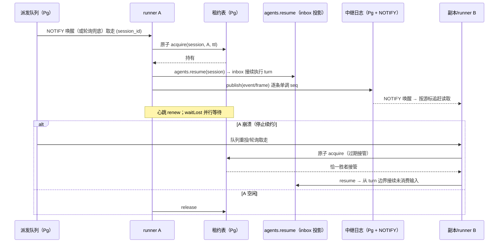

# delta — core-system-map.md（变更 agent-runner-pool）

## ADDED — 11. 执行池（agent-runner-pool 引入）

M3 在第 10 节共享持久层之上落执行池：会话执行从每用户本地 Host 进程升级为可多副本、可接管的 runner 池。核心缝签名与 `agent-loop` 零改动——租约在「启动 Agent 前获取、丢失即 cancel」的外层实现；派发与中继全部落新 Service Definition 与新编排包。

### 11.1 组件

| 组件 | 包 | 实现的缝 | 说明 |
|------|-----|---------|------|
| 会话租约 Service Definition | `packages/core/session-lease`（`@deepseek-ai/dsh-session-lease`） | `ctx.sessionLease` | `acquire(sessionId, owner, ttl)` / `renew` / `release` / `ownerOf` / `waitLost`；对应 JSONL 后端 single-writer claim 的跨节点版（方案 B8），`agent-loop` 零感知 |
| 会话租约 Postgres Provider | `packages/core/session-lease-postgres`（`@deepseek-ai/dsh-session-lease-postgres`） | `ctx.sessionLease` | 租约表承载；获取与过期接管为同一条原子 `UPDATE`，并发恰一胜者 |
| 流中继 Service Definition | `packages/core/stream-relay`（`@deepseek-ai/dsh-stream-relay`） | `ctx.streamRelay` | `publish(sessionId, record)` / `subscribe(sessionId, fromSeq)`；record 为 `session/event` 或 assistant-stream 帧的序列化形态，按会话单调序号 |
| 流中继 Postgres Provider | `packages/core/stream-relay-postgres`（`@deepseek-ai/dsh-stream-relay-postgres`） | `ctx.streamRelay` | 中继日志表 + `LISTEN/NOTIFY` 唤醒 + 序号追赶；NOTIFY 仅作唤醒信号（载荷上限 8000 字节），记录本体走共享表。Redis pub/sub 为该缝的后续 Provider |
| 派发队列与 Runner 编排 | `packages/core/agent-dispatch`（`@deepseek-ai/dsh-agent-dispatch`） | `ctx.agentDispatch` | 队列表（会话 id 去重）+ `publish(sessionId)` + Runner 编排循环（取队列 → `sessionLease.acquire` → `agents.resume`（durable inbox 投影接续，B3）→ `waitLost` 即 `agent.cancel` → 空闲释放）；定义/提供者/消费者三层在本包闭环 |

既有包改动（小）：`packages/api/session-controller`——history/follow 数据面加 stream-relay 增量源（非属主副本冷读共享层后从 relay 追加 live 事件与 assistant-stream 基线，浏览器 follow 语义不变）。

驱动与测试基建：沿用 M2 的纯 JS `postgres` 驱动与 `@embedded-postgres/linux-x64` 免 root 真实服务器二进制，二进制缺失时相关用例显式 skip（不假绿）。

### 11.2 DDL（租约/队列/中继）

```sql
-- 会话租约：一行一会话；获取与过期接管为同一条原子 UPDATE
CREATE TABLE IF NOT EXISTS session_leases (
  session_id       TEXT PRIMARY KEY,
  owner_node       TEXT NOT NULL,
  lease_expires_at BIGINT NOT NULL,           -- epoch 毫秒
  acquired_at      BIGINT NOT NULL
);

-- 派发队列：会话 id 去重（唯一约束）；取走即删，重投可再入
CREATE TABLE IF NOT EXISTS agent_dispatch_queue (
  session_id  TEXT PRIMARY KEY,
  enqueued_at BIGINT NOT NULL
);

-- 流中继日志：每会话单调序号；NOTIFY 只唤醒，本体从表按序读取
CREATE TABLE IF NOT EXISTS stream_relay_log (
  session_id  TEXT NOT NULL,
  seq         BIGINT NOT NULL,
  kind        TEXT NOT NULL,                  -- 'session-event' | 'stream-frame'
  payload     TEXT NOT NULL,                  -- lossless JSON
  created_at  BIGINT NOT NULL,
  PRIMARY KEY (session_id, seq)
);
```

- **租约原子语义**：`UPDATE session_leases SET owner_node=$2, lease_expires_at=$3, acquired_at=$4 WHERE session_id=$1 AND (owner_node=$2 OR lease_expires_at < now_ms)`——行不存在时先 `INSERT ... ON CONFLICT DO NOTHING` 再走同条 UPDATE；并发获取/接管恰一胜者（`owner_node=$2` 覆盖自己续约/重取，`lease_expires_at < now` 覆盖过期接管）。
- **接管点不变式**：接管只允许 turn 边界——接管方经 `agents.resume` 从共享层重放会话日志 + durable inbox 投影接续（方案 §10 风险缓解：必经「源事件日志重放 + inbox 投影」）。
- **中继序号不变式**：`(session_id, seq)` 主键保证每会话序号严格单调；发布为单条 INSERT，序号由每会话行内自增（`SELECT max(seq)` 于同事务）。

### 11.3 Runner 编排时序



### 11.4 与既有件的关系

- **会话持久层（§10）**：Runner 的执行入口 `agents.resume` 即「从共享层加载会话」；中继的 `session/event` 记录源自 SessionStore 的既有事件（model-visible ⟺ logged 不变量不受影响——中继只搬运已落日志的事件）。
- **域命名空间（§10.5）**：租约/队列/中继表为部署级共享设施，不按用户派生命名空间（会话 id 已含归属：fleet 网关按用户路由后才会话才进入派发）。
- **fleet（§9）**：M1 网关按用户路由到本地 Host；M3 之后部署可选择把「执行」切到 runner 池（并列形态，未配置时行为与现状一致）。
- **终端/jobs 亲和他**：`sessionLease.ownerOf(sessionId)` 提供属主节点信息面；PTY 进程远程化与 Web/API 副本无状态化编排延后（5.3 不做清单）。

### 11.5 契约与验收绑定

- `session-lease-postgres` 覆盖：获取/续约/释放/属主查询、并发获取恰一胜者、过期接管恰一胜者、`waitLost` settle。
- `stream-relay-postgres` 覆盖：单调序号、双订阅者同帧序、游标追赶无缺口无重复、NOTIFY 丢失时轮询兜底。
- `agent-dispatch` 覆盖：入队去重、取走-重投、先租约后执行、`waitLost` → cancel → 释放、kill-runner 接管接续（turn 边界）。
