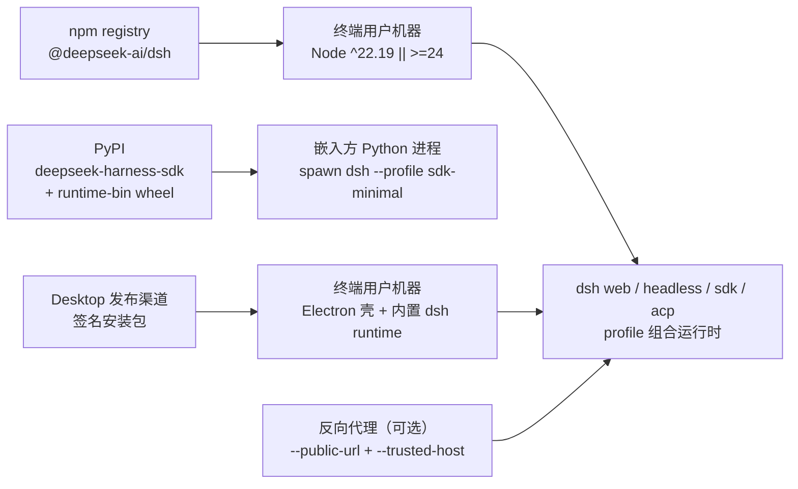
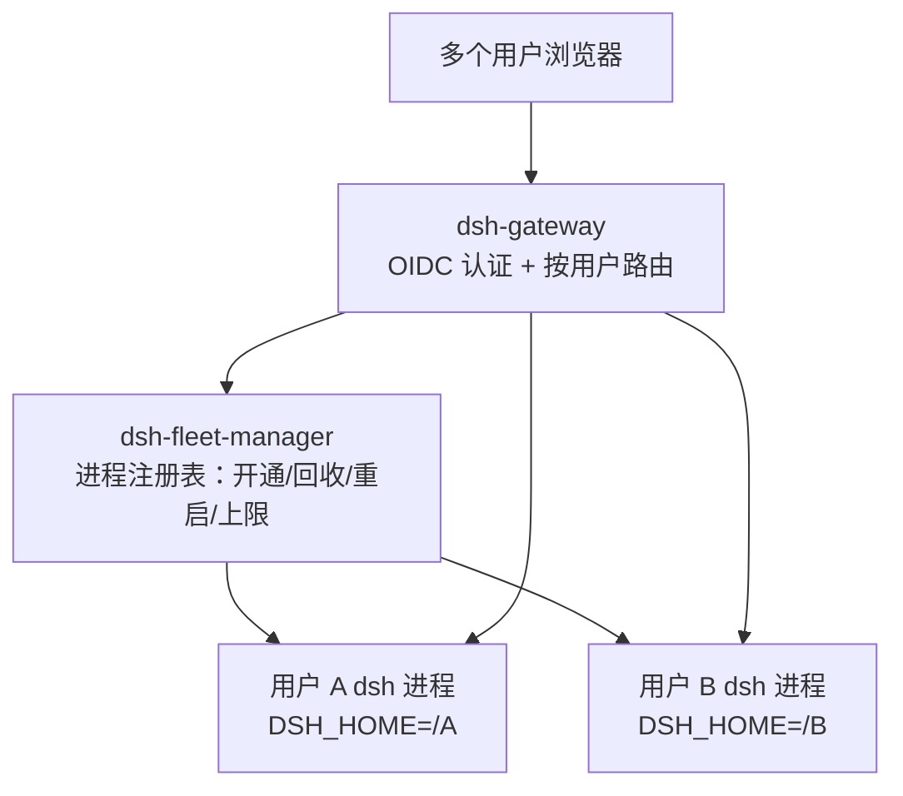
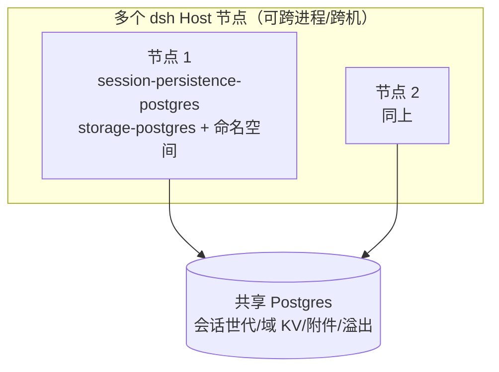
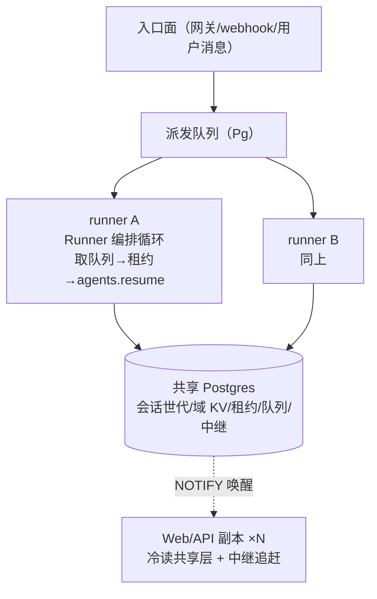

# delta — core-01-deployment-plan.md（变更 agent-runner-pool）

## MODIFIED — 二、部署拓扑

## 二、部署拓扑

**fleet 形态拓扑（user-fleet-gateway 起，多用户自托管部署）**：

- fleet 是**新增部署形态**，与既有单用户拓扑并存：单用户路径（`dsh web` 直启、`--public-url` 反代）行为不变。
- fleet 组件为部署侧新组件（`dsh-gateway`、`dsh-fleet-manager`），每用户 dsh 进程仍由既有 profile 组合启动。

**共享持久层拓扑（shared-persistence-backends 起，fleet 可选扩展）**：

- 共享持久层是 fleet 的**可选并列后端**：未配置时全部数据仍在每用户 `$DSH_HOME` 本地（JSONL/SQLite/local 附件），行为不变；配置共享 Postgres 后，会话世代、域 KV、附件/溢出落在共享库，任一节点可打开同一用户历史会话。
- staging 验证用 `@embedded-postgres/linux-x64` 免 root 真实 Postgres 二进制起共享库；不需要 root 或系统服务。

事实来源：`README.md`（Run from npm）、`docs/architecture.md` §Application launch/§Desktop application、`python/sdk-runtime/pyproject.toml`；fleet 形态见变更 `user-fleet-gateway` 提案与系统地图 §9；共享持久层见系统地图 §10。

**执行池拓扑（agent-runner-pool 起，共享持久层之上的可选执行形态）**：

- 执行池是共享持久层之上的**可选并列执行形态**：未配置时执行仍在每用户本地 Host 进程（M1 现状），行为不变；配置后同一会话任意时刻至多一个活跃 runner（租约仲裁），runner 崩溃后其他节点在租约过期内接管续跑。
- runner/副本进程为库级 Runner 编排驱动（staging 先例同共享持久层 driver）；Redis pub/sub 中继与 PTY 远程化不做（5.3 清单）。

## MODIFIED — 三、环境变量与密钥

## 三、环境变量与密钥

| 项 | 来源 | 用途 |
|---|---|---|
| `DEEPSEEK_API_KEY` / `DEEPSEEK_BASE_URL` | 进程环境或根 `.env` | 真实模型调用（e2e/演示；无 key 自跳过） |
| 用户 API key | `$DSH_HOME/.credentials.yaml`（经 settings 引用） | 会话模型调用；设置中仅存凭证引用 |
| `DSH_GITHUB_WEBHOOK_SECRET` | 部署 overlay 配置 | `/github` webhook 签名校验 |
| `HTTPS_PROXY`/`NO_PROXY`/`NODE_EXTRA_CA_CERTS` | 进程环境 | 代理网络与企业 TLS 拦截（`docs/user/guide/network-proxy.md`） |
| Windows 打包/签名密钥 | 发布者本地（EV 签名，见 `apps/desktop/README.md`） | Desktop 安装包签名 |
| OIDC issuer / client id / client secret | fleet 部署配置 | 网关认证（外部 OIDC 提供方） |
| fleet 用户 home 根目录 | fleet 部署配置 | 每用户 `$DSH_HOME` 的分配根（如 `<data>/homes/<subject>`） |
| fleet 并发上限 / 空闲回收阈值 / CPU 阈值 | fleet 部署配置（Config 字段，非硬编码） | 资源控制主旋钮：限制同时存活的用户进程数；staging 验收取小上限 |
| 共享 Postgres 连接串 | 部署配置（cordis.yml 配置字段） | `session-persistence-postgres` / `storage-postgres` / `attachment-postgres` / `spill-postgres` 指向共享库；缺失时各缝走本地默认后端，行为不变 |
| `DSH_FLEET_USER_ID` | fleet 管理器注入用户进程环境（M1 既有） | storage-domain 提供方派生每用户命名空间；未注入时走默认命名空间（单机行为不变） |

密钥原则：仓库内永不提交凭证；设置与日志只存凭证引用（`packages/credentials/`）。OIDC client secret 属部署密钥，同样不入库；共享 Postgres 连接串如含口令亦属部署密钥，只进部署配置不入库。
| 执行池租约/队列/中继连接串 | 部署配置（cordis.yml 配置字段） | `session-lease-postgres` / `stream-relay-postgres` / `agent-dispatch` 指向共享库；缺失时执行池不启用，执行留在本地 Host 进程，行为不变 |
| runner 节点标识 | 部署配置（每 runner 唯一） | 租约持有者标识与属主路由信息面（`ownerOf`）；staging 取 `runner-a`/`runner-b` |

## MODIFIED — 七、部署后检查清单

## 七、部署后检查清单

1. `dsh --version` 输出预期版本。
2. `dsh --profile 
 --dump-config` 能打印组合树（不启动应用即验证组合层）。
3. `dsh web` 在目标机器就绪并打印 URL；浏览器可开。
4. 无 key 启动应出现凭证引导而非崩溃（fail-loud 于最早可解析点）。
5. Desktop 安装包签名校验通过、首次启动进入 API-key 页或工作区。
6. `python -c "import deepseek_harness"` + 最小 run 可用（嵌入方环境）。
7. fleet 形态（如部署）：网关就绪、OIDC 发现可达、fleet 管理器运行；测试用户登录可开通专属进程。
8. 资源约束生效：fleet 并发上限按部署配置拒绝超额开通；验收/冒烟执行期间主机 CPU 利用率不超过部署配置阈值（冒烟用例串行执行，不并行拉起超量用户进程）。
9. 共享持久层（如部署）：共享 Postgres 可达、新后端表结构已创建；两个 dsh Host 实例指向同库时，任一节点可打开同一用户的历史会话（SMOKE-core-12）。
10. 命名空间隔离（如部署）：两个不同 fleet 用户的进程共享同库时，域数据互不可见（SMOKE-core-13）。
11. 执行池（如部署）：共享 Postgres 可达、租约/队列/中继表已创建；两个 runner 进程指向同库时，同一会话的并发执行被租约排除；kill 正在执行的 runner 后其他节点在租约过期内接管并接续 inbox 未消费输入（SMOKE-core-14）。
12. 流中继（如部署）：runner 执行中，非属主副本从中继按游标追赶，双副本看到相同帧序（SMOKE-core-15）。

## MODIFIED — 八、冒烟测试方案

## 八、冒烟测试方案

smoke 输入（具体 `SMOKE-*` 用例见 `logos/resources/test/smoke/core-smoke-test-cases.md`）：

- **健康检查**：`dsh --version`、profile dump-config、Desktop 首启。
- **核心入口**：`dsh web` URL 可达、`dsh headless` 最小任务（有 key 环境）、SDK initialize。
- **静态资源**：`dsh web` 伺服前端 dist（index 与 bundle 200）。
- **配置与密钥**：无凭证 fail-loud 检查、`.env` 读取、`--public-url`/`--trusted-host` 组合校验。
- **关键链路**：单会话 prompt→工具调用→最终答案（staging 有 key 时）；审批流一次性授权。
- **日志与监控**：启动日志无阻断性错误；fatal 错误经 Desktop IPC 上报。
- **fleet 认证与隔离**：网关 OIDC 登录开通、双用户隔离抽查、生命周期与资源上限（SMOKE-core-09..11）。执行约束：冒烟串行执行，主机 CPU 利用率不超过部署配置阈值。
- **共享持久层**：双节点指向同一共享 Postgres 各自打开同一用户历史会话、每用户命名空间互不可见（SMOKE-core-12/13）。执行约束同上：两个实例串行操作，嵌入式 Postgres 与双实例同时运行时监控 CPU 不超阈值。

目标环境：staging（对应 CI/发布前验证机；`deployment_gates.core.environments: [staging]`）。
- **执行池**：kill 正在执行 turn 的 runner → 其他节点租约过期内接管接续；双副本连不同节点看同一会话流式实时（SMOKE-core-14/15）。执行约束同上：runner 操作串行触发，嵌入式 Postgres 与多进程同时运行时监控 CPU 不超阈值。
