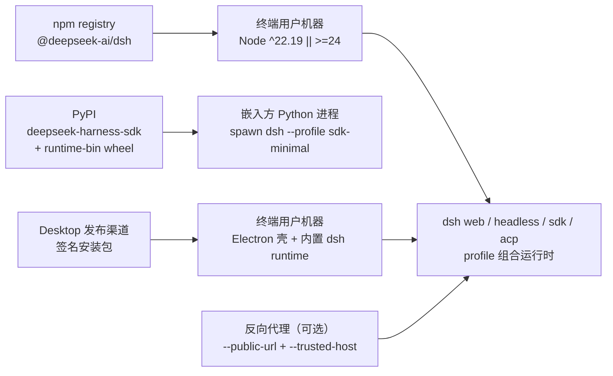
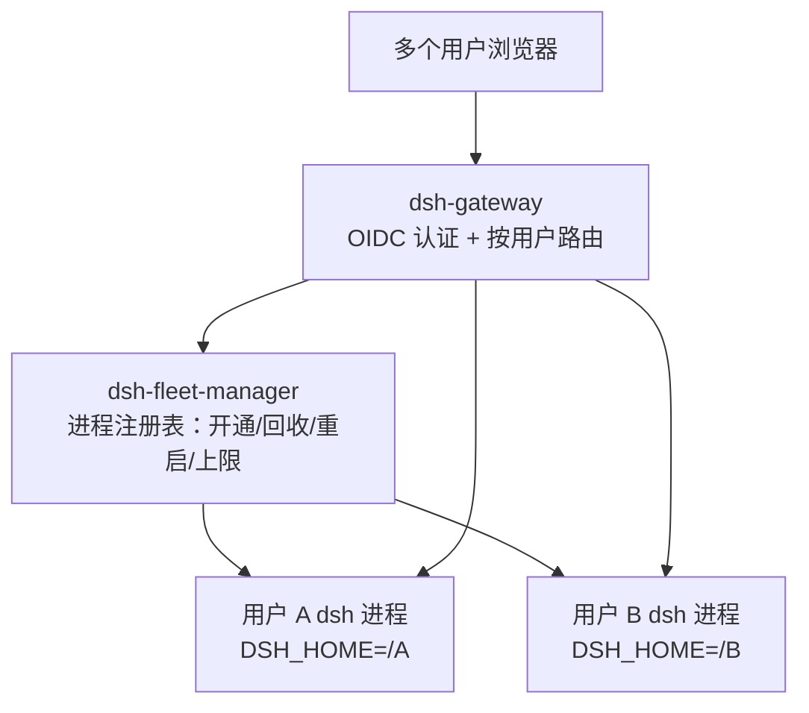

# delta — core-01-deployment-plan.md（变更 user-fleet-gateway）

## MODIFIED — 二、部署拓扑

**fleet 形态拓扑（user-fleet-gateway 起，多用户自托管部署）**：

- fleet 是**新增部署形态**，与既有单用户拓扑并存：单用户路径（`dsh web` 直启、`--public-url` 反代）行为不变。
- fleet 组件为部署侧新组件（`dsh-gateway`、`dsh-fleet-manager`），每用户 dsh 进程仍由既有 profile 组合启动。

事实来源：`README.md`（Run from npm）、`docs/architecture.md` §Application launch/§Desktop application、`python/sdk-runtime/pyproject.toml`；fleet 形态见变更 `user-fleet-gateway` 提案与系统地图 §9。

## MODIFIED — 三、环境变量与密钥

| 项 | 来源 | 用途 |
|---|---|---|
| `DEEPSEEK_API_KEY` / `DEEPSEEK_BASE_URL` | 进程环境或根 `.env` | 真实模型调用（e2e/演示；无 key 自跳过） |
| 用户 API key | `$DSH_HOME/.credentials.yaml`（经 settings 引用） | 会话模型调用；设置中仅存凭证引用 |
| `DSH_GITHUB_WEBHOOK_SECRET` | 部署 overlay 配置 | `/github` webhook 签名校验 |
| `HTTPS_PROXY`/`NO_PROXY`/`NODE_EXTRA_CA_CERTS` | 进程环境 | 代理网络与企业 TLS 拦截（`docs/user/guide/network-proxy.md`） |
| Windows 打包/签名密钥 | 发布者本地（EV 签名，见 `apps/desktop/README.md`） | Desktop 安装包签名 |
| OIDC issuer / client id / client secret | fleet 部署配置 | 网关认证（外部 OIDC 提供方） |
| fleet 用户 home 根目录 | fleet 部署配置 | 每用户 `$DSH_HOME` 的分配根（如 `<data>/homes/<subject>`） |
| fleet 并发上限 / 空闲回收阈值 / CPU 阈值 | fleet 部署配置（Config 字段，非硬编码） | 资源控制主旋钮：限制同时存活的用户进程数；staging 验收取小上限 |

密钥原则：仓库内永不提交凭证；设置与日志只存凭证引用（`packages/credentials/`）。OIDC client secret 属部署密钥，同样不入库。

## MODIFIED — 四、构建与发布命令

| 步骤 | 命令 | 事实来源 |
|---|---|---|
| 安装依赖 | `pnpm install`（node ^22.19 \|\| >=24） | `AGENTS.md` |
| 全量构建 | `pnpm run build`（tsc → lib/types；tsdown → runtime bundle） | `AGENTS.md` |
| 本地源码启动 | `pnpm dsh web` / `pnpm run dev:web` / `make web\|desktop` | `AGENTS.md`、`README.md` |
| 单元/覆盖门禁 | `pnpm run test` / `test:coverage`（per-file 100%） | `AGENTS.md`、`docs/testing.md` |
| 发布序列 | release 提交 + 版本 tag（如 `release(dsh): 0.2.1-alpha.1`） | git log `ec48669f48` |
| Desktop 打包 | `apps/desktop` 构建脚本（签名/公证；Windows EV 签名必读 `apps/desktop/README.md`） | `apps/desktop/README.md` |
| Python wheel | hatchling 构建（`python/sdk`、`python/sdk-runtime`） | `python/*/pyproject.toml` |
| fleet 组件构建 | `dsh-gateway`、`dsh-fleet-manager` 随全量构建产出（`pnpm run build`） | 变更 `user-fleet-gateway`（[code] 阶段新增组件） |

## MODIFIED — 七、部署后检查清单

1. `dsh --version` 输出预期版本。
2. `dsh --profile 
 --dump-config` 能打印组合树（不启动应用即验证组合层）。
3. `dsh web` 在目标机器就绪并打印 URL；浏览器可开。
4. 无 key 启动应出现凭证引导而非崩溃（fail-loud 于最早可解析点）。
5. Desktop 安装包签名校验通过、首次启动进入 API-key 页或工作区。
6. `python -c "import deepseek_harness"` + 最小 run 可用（嵌入方环境）。
7. fleet 形态（如部署）：网关就绪、OIDC 发现可达、fleet 管理器运行；测试用户登录可开通专属进程。
8. 资源约束生效：fleet 并发上限按部署配置拒绝超额开通；验收/冒烟执行期间主机 CPU 利用率不超过部署配置阈值（冒烟用例串行执行，不并行拉起超量用户进程）。

## MODIFIED — 八、冒烟测试方案

smoke 输入（具体 `SMOKE-*` 用例见 `logos/resources/test/smoke/core-smoke-test-cases.md`）：

- **健康检查**：`dsh --version`、profile dump-config、Desktop 首启。
- **核心入口**：`dsh web` URL 可达、`dsh headless` 最小任务（有 key 环境）、SDK initialize。
- **静态资源**：`dsh web` 伺服前端 dist（index 与 bundle 200）。
- **配置与密钥**：无凭证 fail-loud 检查、`.env` 读取、`--public-url`/`--trusted-host` 组合校验。
- **关键链路**：单会话 prompt→工具调用→最终答案（staging 有 key 时）；审批流一次性授权。
- **日志与监控**：启动日志无阻断性错误；fatal 错误经 Desktop IPC 上报。
- **fleet 认证与隔离**：网关 OIDC 登录开通、双用户隔离抽查、生命周期与资源上限（SMOKE-core-09..11）。执行约束：冒烟串行执行，主机 CPU 利用率不超过部署配置阈值。

目标环境：staging（对应 CI/发布前验证机；`deployment_gates.core.environments: [staging]`）。
