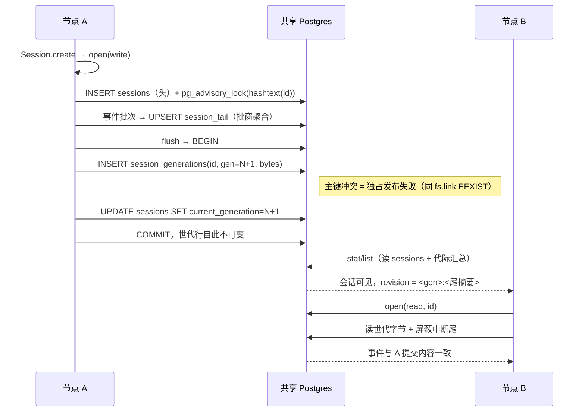

# delta — core-S34-shared-session-generations.md（变更 shared-persistence-backends）

## ADDED — core S34: 共享会话世代的跨节点读写与崩溃恢复（场景实现）

# core S34: 共享会话世代的跨节点读写与崩溃恢复（场景实现）

> 来源：变更 `shared-persistence-backends`（M2 共享持久层）。场景定义见 `core-01-requirements.md` §S34；交互规格见 `core-01-feature-design.md` §5。

## 1. 参与者

| 参与者 | 职责 |
|---|---|
| 节点 A / 节点 B | 两个 dsh Host 进程，配置指向同一共享 Postgres 库 |
| session-persistence-postgres | `SessionPersistence` 缝的 Postgres 后端：世代表 + 尾表 + 会话级锁 |
| 共享 Postgres | 世代字节、代际指针、advisory lock 的承载与仲裁 |

## 2. 主路径时序（跨节点互见 + 独占发布）

要点：

1. **世代语义与 JSONL 对齐**：已提交世代是不可变行；「发布新世代 + 指针推进」在同一事务，读者只见完整世代。
2. **写式互斥在共享库仲裁**：advisory lock 以会话 id 为键，A 持锁期间 B 写式打开明确失败；close 释放后 B 从已提交 next-seq 续写。
3. **freshness 不变**：create 即本进程可见，物化（世代发布）只是持久化优化——与缝文档钉死的可见性语义一致。

## 3. 异常流

| 异常 | 行为 |
|---|---|
| A 写式中断（进程消失，留下半行尾） | 尾的最后一行无终止符 → 读路径屏蔽；下一次写式打开按 repair 语义截断合成收尾，已提交世代行不动（S34-AC-02） |
| B 在 A 持写式句柄期间写式打开 | advisory lock 占用 → 明确占用失败，无双写者（S34-AC-03） |
| 共享层存在高于本节点认知的代际格式 | `SessionFormatUnsupportedError` 同族明确拒绝，不静默降级（S34-AC-04） |
| append 的 seq 不连续 / 非 JSON / 未知事件类型 | 复用 `session-persistence` 校验原语，拒绝行为与 JSONL 逐条一致，失败的写式打开不留下所有权 |

## 4. 验收条件映射

| AC | 来源 | 覆盖测试 |
|---|---|---|
| S34-AC-01 正常：双节点互见 | 需求文档 §S34 | ST-S34-01、UT-S34-01 |
| S34-AC-02 正常：崩溃恢复 | 需求文档 §S34 | ST-S34-02、UT-S34-02 |
| S34-AC-03 异常：写式互斥 | 需求文档 §S34 | ST-S34-03、UT-S34-03 |
| S34-AC-04 异常：未来版本拒绝 | 需求文档 §S34 | UT-S34-04 |
