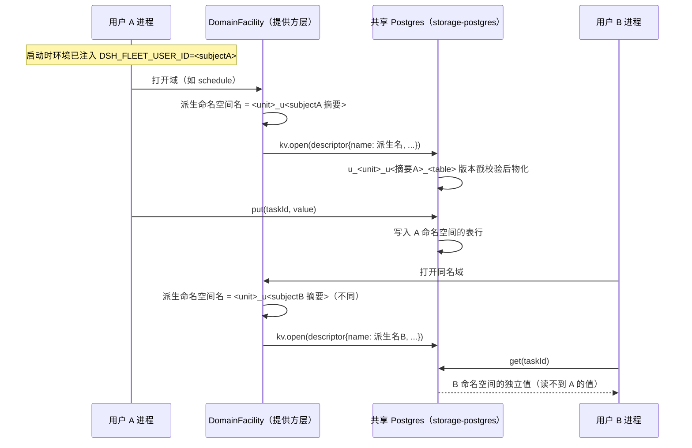

# delta — core-S35-shared-domain-namespace.md（变更 shared-persistence-backends）

## ADDED — core S35: 共享域数据的每用户命名空间（场景实现）

# core S35: 共享域数据的每用户命名空间（场景实现）

> 来源：变更 `shared-persistence-backends`（M2 共享持久层）。场景定义见 `core-01-requirements.md` §S35；交互规格见 `core-01-feature-design.md` §5。

## 1. 参与者

| 参与者 | 职责 |
|---|---|
| 用户 A / 用户 B 的 dsh Host 进程 | 各自注入自己的 fleet subject（`DSH_FLEET_USER_ID`，M1 链路） |
| storage-domain（DomainFacility） | 命名空间注入点：把每个域 unit 名派生为用户专属命名空间名 |
| storage-postgres | `StorageBackend.kv` 共享后端；只见到（已派生命名的）unit，不感知用户概念 |
| schedule / workspace / 投影缓存等域 | 域实现零改动，以为自己在用原名 unit |

## 2. 主路径时序（命名空间派生与隔离）

要点：

1. **派生在提供方层一处收口**：域声明、域实现、KV 后端全部零感知；unit 名层派生同时让 global 槽位天然按用户分离。
2. **默认命名空间 = 原名**：未注入 fleet 身份的单机进程走原 unit 名，行为与现状（storage-sqlite）一致。
3. **派生名确定性且安全**：subject 经确定性安全编码进 `UNIT_NAME_RE` 允许集；同名域在不同用户命名空间下是互不相干的表组。

## 3. 异常流

| 异常 | 行为 |
|---|---|
| A 的域 API 以 B 的键名读写 | 键空间在 A 命名空间内闭合——读写落在 A 的表组，触达不到 B 的数据；不存在跨命名空间寻址入口（S35-AC-03） |
| 派生名与既有普通 unit 名冲突（摘要碰撞） | 派生算法保证确定性唯一编码；如仍检出冲突，提供方 loud fail（配置/实现错误早暴露，不静默合并数据） |
| Postgres 不可达 | 域打开时明确失败（misconfiguration fails loud），不静默回退本地存储 |
| unit 版本不符 | `version-mismatch` 拒绝，语义与 sqlite 后端一致 |

## 4. 验收条件映射

| AC | 来源 | 覆盖测试 |
|---|---|---|
| S35-AC-01 正常：命名空间互不可见 | 需求文档 §S35 | ST-S35-01、UT-S35-01 |
| S35-AC-02 正常：单机行为不变 | 需求文档 §S35 | UT-S35-02 |
| S35-AC-03 异常：域 API 不暴露跨命名空间寻址 | 需求文档 §S35 | UT-S35-03 |
