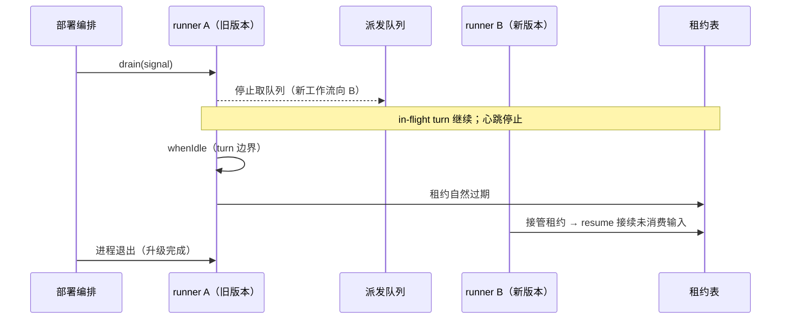

# delta — core-system-map.md（变更 distributed-host-services）

## ADDED — 12. Host 本地服务分布式化（distributed-host-services 引入）

M4 在执行池（§11）之上把 Host 本地服务升级为集群语义：schedule 到期计算移到共享库、webhook 入口无状态化、配置只读形态禁用 HMR、runner 排空支撑滚动升级。既有缝签名、`ScheduleService` 单机形态与 `agent-loop` 零改动——分布式 schedule 为并列 Provider，webhook 消费复用执行池原语。

### 12.1 组件

| 组件 | 包 | 实现的缝 | 说明 |
|------|-----|---------|------|
| 共享 schedule 派发 | `packages/schedule/schedule-dispatch`（`@deepseek-ai/dsh-schedule-dispatch`） | 并列 Provider（单机 `ScheduleService` 不变） | `schedule_due` 表（每任务一行、`next_due_at` 单调推进）+ `FOR UPDATE SKIP LOCKED` 恰一取用 + 租约约束投递；「重启后恢复」「仅补最近一次错过」由表行与 next-due 推进钉住（A6 只换触发器） |
| webhook 无状态入口 | `packages/webhook/webhook-ingress`（`@deepseek-ai/dsh-webhook-ingress`） | 并列 Provider（单机直接建会话形态不变） | `webhook_events` 表（去重键唯一）+ 签名校验入队 + `NOTIFY`；消费循环恰一取事件、建 Workspace Session、入执行池队列（A9 入口/执行解耦） |
| runner 排空 | `packages/core/agent-dispatch`（既有包小改） | `drain(signal)` | 停止取队列、停止租约心跳、等待 in-flight drive 到 turn 边界（`whenIdle`）后返回；滚动升级按会话粒度排空（§8-4） |
| HMR 只读禁用 | `packages/boot/hmr`（既有包小改） | 配置形态门 | `DSH_CONFIG_READONLY=1`（集群共享只读配置语义）时 fail-closed 拒绝启用（headless/SDK 先例，A10） |

驱动与测试基建：沿用 M2/M3 的纯 JS `postgres` 驱动与 `@embedded-postgres/linux-x64` 免 root 二进制，二进制缺失显式 skip（不假绿）。

### 12.2 DDL（schedule/webhook）

```sql
-- 共享 schedule：每任务一行；next_due_at 单调推进，交付与推进同事务
CREATE TABLE IF NOT EXISTS schedule_due (
  task_id      TEXT PRIMARY KEY,
  session_id   TEXT NOT NULL,
  prompt       TEXT NOT NULL,
  title        TEXT NOT NULL,
  next_due_at  BIGINT NOT NULL,              -- epoch 毫秒
  recurrence   TEXT NOT NULL,                -- 'once' | 'recurring'
  active       BOOLEAN NOT NULL DEFAULT TRUE,
  updated_at   BIGINT NOT NULL
);

-- webhook 入口事件：去重键唯一；消费恰一
CREATE TABLE IF NOT EXISTS webhook_events (
  dedupe_key   TEXT PRIMARY KEY,
  payload      TEXT NOT NULL,                -- lossless JSON（含 workspace/prompt 等建会话字段）
  state        TEXT NOT NULL DEFAULT 'pending',  -- 'pending' | 'done'
  created_at   BIGINT NOT NULL,
  consumed_at  BIGINT
);
```

- **SKIP LOCKED 取用不变式**：`SELECT … WHERE next_due_at <= now FOR UPDATE SKIP LOCKED` 在同一事务内取行、取会话租约、投递、推进 next-due、提交——并发 runner 恰一取用；崩溃回滚释放行锁，交付不丢。
- **next-due 推进不变式**：交付后 `next_due_at` 推进到首个严格未来匹配时刻（recurring）或标记完成（once）；连续错过多次仅交付最近一次错过的 occurrence——与单机「仅补最近一次错过的 recurring」逐条一致。
- **webhook 幂等不变式**：`dedupe_key` 主键使重复投递至多一行；消费事务内 `state='pending' → done` 与建会话同提交，崩溃回滚重新取用。
- **排空不变式**：drain 后 runner 不再进入取循环、心跳停止；in-flight drive 以 `whenIdle` 等待 turn 边界；租约自然过期由其他 runner 经既有接管路径（§11）接续。

### 12.3 排空与滚动升级时序



### 12.4 与既有件的关系

- **执行池（§11）**：schedule-dispatch 与 webhook 消费复用其租约原语与会话恢复路径；drain 是其编排方法。webhook 建会话后直接走既有派发队列。
- **共享持久层（§10）**：提醒投递与会话接续的日志读写全部经共享层；「升级后旧会话可打开」由会话代际 + 相邻迁移兜底（B2），本变更不新增任何会话格式版本。
- **fleet（§9）**：profile 镜像形态（固定层烘焙 + 用户层共享只读挂载）是 fleet 部署打包要求；`DSH_CONFIG_READONLY=1` 是其运行时声明，HMR 据此 fail-closed。

### 12.5 契约与验收绑定

- `schedule-dispatch` 覆盖：并发取用恰一、取用后崩溃不丢、recurring 仅补最近一次错过、全新进程无本地状态恢复、单机形态并存。
- `webhook-ingress` 覆盖：入队去重、消费恰一建会话、消费崩溃不丢、入口水平复制幂等。
- `agent-dispatch.drain` 覆盖：排空后新工作流向其余 runner、in-flight 到 turn 边界收尾、接管续跑。
- HMR 只读禁用：`DSH_CONFIG_READONLY=1` 下插件装配 fail-closed。
