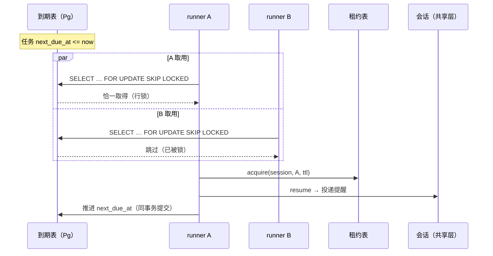

## ADDED — core S40: 共享 schedule 到期恰一交付（场景实现）

> 来源：变更 `distributed-host-services`（M4 Host 本地服务分布式化）。场景定义见 `core-01-requirements.md` §S40；交互规格见 `core-01-feature-design.md` §7。

## 1. 参与者

| 参与者 | 职责 |
|---|---|
| runner A / runner B | 运行到期派发循环的集群节点 |
| schedule-dispatch | `schedule_due` 表 + `FOR UPDATE SKIP LOCKED` 取用循环 |
| 共享 Postgres | 到期行、行锁与事务的承载 |
| session-lease | 投递前的会话租约约束（复用 §11） |

## 2. 主路径时序（并发取用恰一交付）

要点：

1. **恰一取用**：`FOR UPDATE SKIP LOCKED` 使并发取用串行化——败者跳过被锁行，无重复投递。
2. **租约约束**：投递前取会话租约，保证投递方就是该会话的执行属主。
3. **崩溃回滚**：取用后未提交即崩溃，行锁随事务回滚释放，下一轮其他 runner 重新取用——不丢。

## 3. 异常流

| 异常 | 行为 |
|---|---|
| 取用后 runner 崩溃 | 事务回滚 → 行锁释放 → 下一轮重新取用交付（S40-AC-02） |
| recurring 连续错过多次 | 恢复后仅交付最近一次错过的 occurrence，next-due 跳到首个未来时刻（S40-AC-03） |
| 会话租约被其他 runner 持有 | 本轮回滚取用，行留给下一轮；投递永远发生在租约持有者上 |
| 全新 runner 进程启动 | 到期表行即全部状态，无需本地恢复（S40-AC-04） |

## 4. 验收条件映射

| AC | 来源 | 覆盖测试 |
|---|---|---|
| S40-AC-01 正常：并发取用恰一交付 | 需求文档 §S40 | UT-S40-01、ST-S40-01 |
| S40-AC-02 异常：取用后崩溃不丢 | 需求文档 §S40 | UT-S40-02、ST-S40-02 |
| S40-AC-03 正常：recurring 仅补最近一次错过 | 需求文档 §S40 | UT-S40-03 |
| S40-AC-04 正常：重启后恢复 | 需求文档 §S40 | UT-S40-04 |
