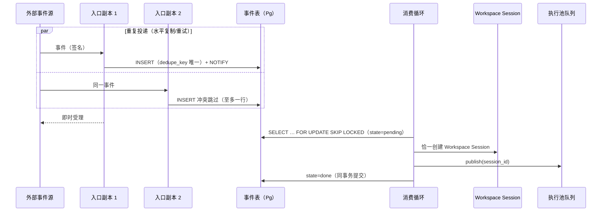

## ADDED — core S41: webhook 入口无状态化恰一建会话（场景实现）

> 来源：变更 `distributed-host-services`（M4 Host 本地服务分布式化）。场景定义见 `core-01-requirements.md` §S41；交互规格见 `core-01-feature-design.md` §7。

## 1. 参与者

| 参与者 | 职责 |
|---|---|
| 外部事件源 | 向入口副本投递 webhook 事件 |
| 入口副本 ×2 | 签名校验 → 事件入共享队列表 → 即时受理（无状态，可水平复制） |
| webhook-ingress 消费循环 | `FOR UPDATE SKIP LOCKED` 恰一取事件 → 建 Workspace Session → 入执行池队列 |

## 2. 主路径时序（恰一建会话）

要点：

1. **入口无状态**：副本只做签名校验与入队，可水平复制；去重键使重复投递至多一行。
2. **消费恰一**：`SKIP LOCKED` + `state='pending' → done` 同事务，崩溃回滚重新取用——不丢不重。
3. **执行解耦**：建会话后走既有派发队列，入口/消费/执行三段独立伸缩。

## 3. 异常流

| 异常 | 行为 |
|---|---|
| 消费取事件后崩溃 | 事务回滚 → state 回到 pending → 下一轮重新取用建会话（S41-AC-02） |
| 两副本重复投递同一事件 | 去重键唯一约束 → 至多一行 → 恰一建会话（S41-AC-03） |
| 建会话后入队前崩溃 | 会话创建与事件完成不同事务——会话已持久但事件重取会再建？否：事件完成与建会话同事务，回滚则两者皆未发生 |

## 4. 验收条件映射

| AC | 来源 | 覆盖测试 |
|---|---|---|
| S41-AC-01 正常：恰一建会话 | 需求文档 §S41 | UT-S41-01、ST-S41-01 |
| S41-AC-02 异常：消费崩溃不丢 | 需求文档 §S41 | UT-S41-02 |
| S41-AC-03 正常：入口水平复制幂等 | 需求文档 §S41 | UT-S41-03、ST-S41-02 |
