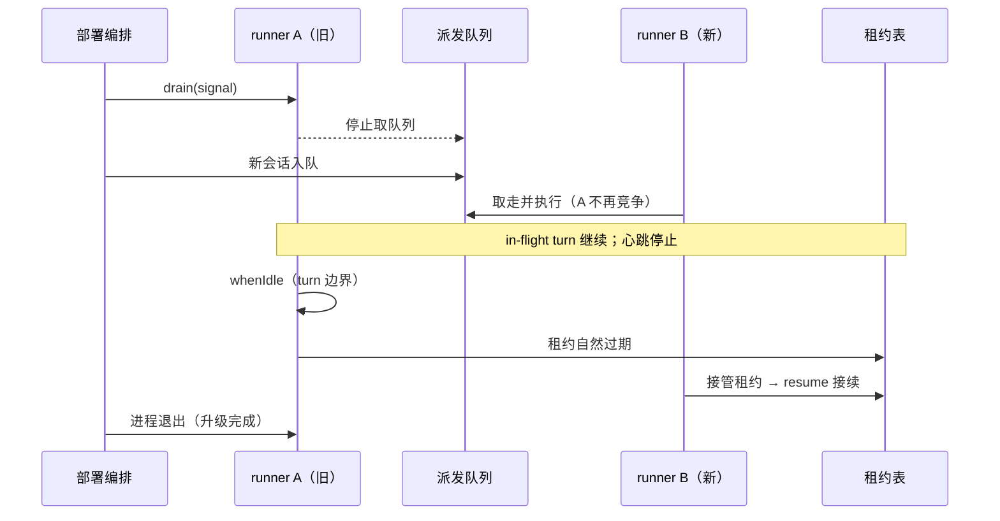

## ADDED — core S42: runner 排空与滚动升级（场景实现）

> 来源：变更 `distributed-host-services`（M4 Host 本地服务分布式化）。场景定义见 `core-01-requirements.md` §S42；交互规格见 `core-01-feature-design.md` §7。

## 1. 参与者

| 参与者 | 职责 |
|---|---|
| 部署编排 | 向旧版本 runner 发出排空指令 |
| runner A（旧版本） | 排空：停取队列、停心跳、等 turn 边界、退出 |
| runner B（新版本） | 继续取队列；接管 A 的到期租约并接续会话 |
| 共享持久层 | 会话日志与 inbox 投影的恢复源（升级后旧会话可打开的兜底） |

## 2. 主路径时序（排空与接管）

要点：

1. **停接新工作**：drain 即退出取循环——新会话立即流向其余 runner。
2. **turn 边界收尾**：in-flight drive 等待 `whenIdle`，不中断进行中的会话。
3. **租约自然过期**：不主动抢释放，而是停心跳让租约按既有接管路径（§11）转移——与 S37/S38 的接管语义复用。
4. **日志兜底**：升级后旧会话的可打开性由会话代际 + 相邻迁移保证，本变更不新增格式版本。

## 3. 异常流

| 异常 | 行为 |
|---|---|
| 排空中有 in-flight turn | 等待 `whenIdle` 到边界后退出；会话日志完整、可立即被接续（S42-AC-02） |
| 排空后新会话入队 | A 不再取队列，B 取走执行（S42-AC-01） |
| 升级后打开旧会话 | 共享层日志 + 代际迁移兜底，完整可读（S42-AC-03） |

## 4. 验收条件映射

| AC | 来源 | 覆盖测试 |
|---|---|---|
| S42-AC-01 正常：排空后新工作流向其余 runner | 需求文档 §S42 | UT-S42-01、ST-S42-01 |
| S42-AC-02 异常：in-flight 会话到边界收尾 | 需求文档 §S42 | UT-S42-02、ST-S42-02 |
| S42-AC-03 正常：升级后旧会话可打开 | 需求文档 §S42 | UT-S42-03 |
