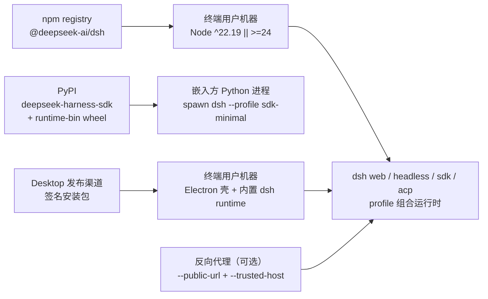
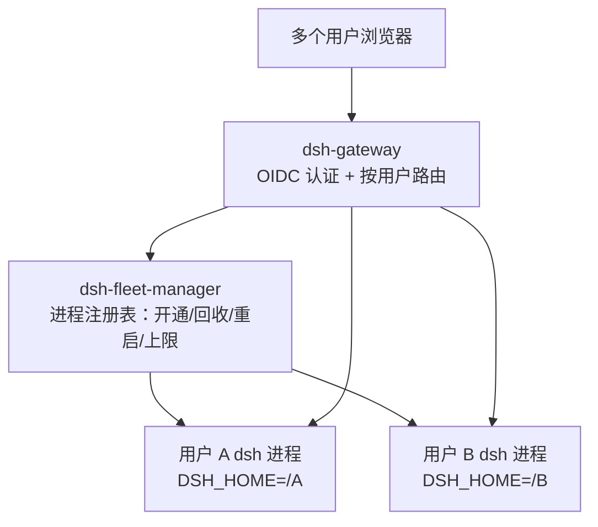
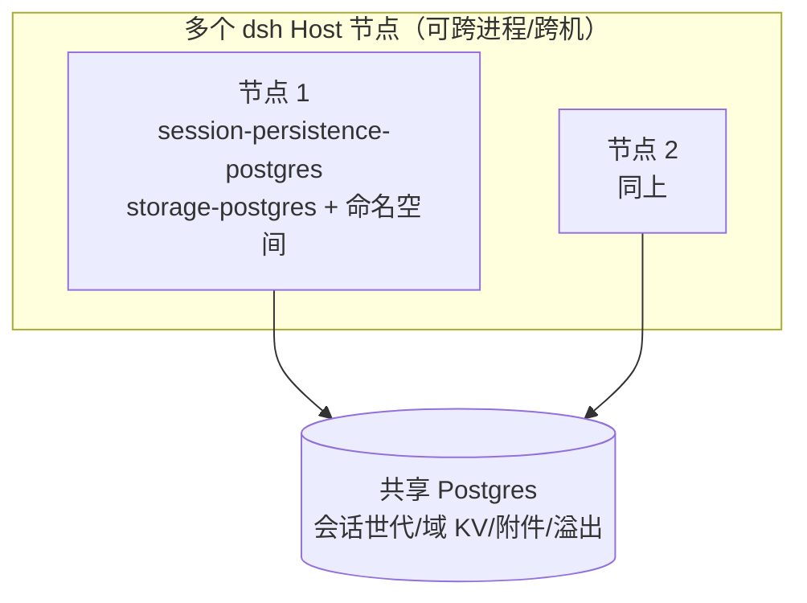
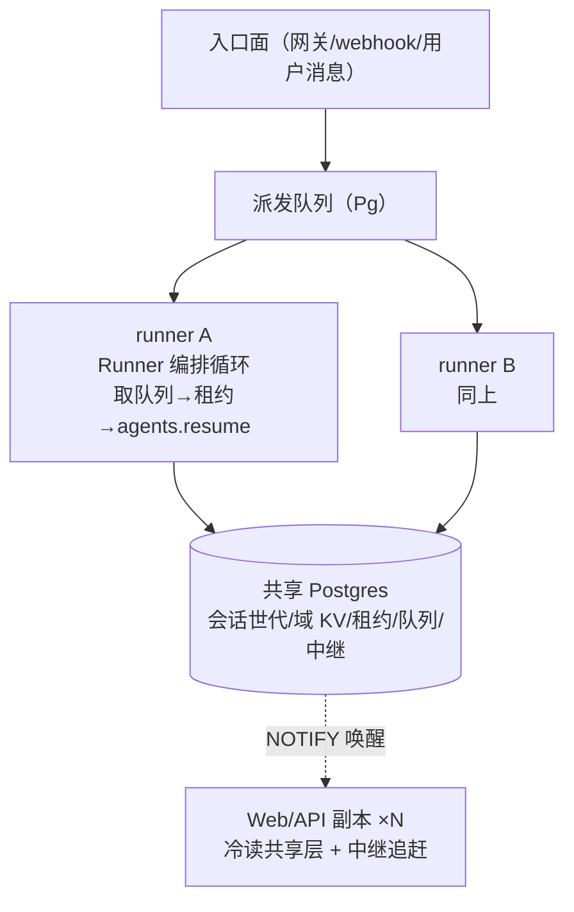
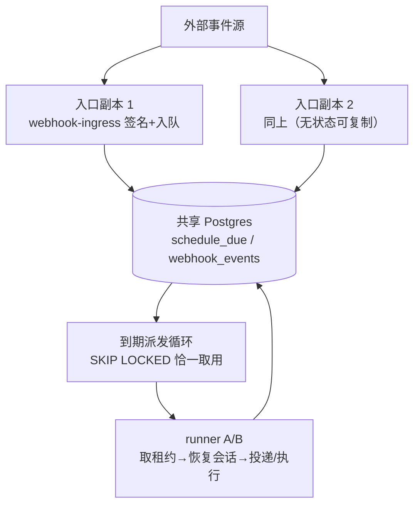

# delta — core-01-deployment-plan.md（变更 stateless-cluster-deployment）

## MODIFIED — 二、部署拓扑

## 二、部署拓扑

**fleet 形态拓扑（user-fleet-gateway 起，多用户自托管部署）**：

- fleet 是**新增部署形态**，与既有单用户拓扑并存：单用户路径（`dsh web` 直启、`--public-url` 反代）行为不变。
- fleet 组件为部署侧新组件（`dsh-gateway`、`dsh-fleet-manager`），每用户 dsh 进程仍由既有 profile 组合启动。

**共享持久层拓扑（shared-persistence-backends 起，fleet 可选扩展）**：

- 共享持久层是 fleet 的**可选并列后端**：未配置时全部数据仍在每用户 `$DSH_HOME` 本地（JSONL/SQLite/local 附件），行为不变；配置共享 Postgres 后，会话世代、域 KV、附件/溢出落在共享库，任一节点可打开同一用户历史会话。
- staging 验证用 `@embedded-postgres/linux-x64` 免 root 真实 Postgres 二进制起共享库；不需要 root 或系统服务。

事实来源：`README.md`（Run from npm）、`docs/architecture.md` §Application launch/§Desktop application、`python/sdk-runtime/pyproject.toml`；fleet 形态见变更 `user-fleet-gateway` 提案与系统地图 §9；共享持久层见系统地图 §10。

**执行池拓扑（agent-runner-pool 起，共享持久层之上的可选执行形态）**：

- 执行池是共享持久层之上的**可选并列执行形态**：未配置时执行仍在每用户本地 Host 进程（M1 现状），行为不变；配置后同一会话任意时刻至多一个活跃 runner（租约仲裁），runner 崩溃后其他节点在租约过期内接管续跑。
- runner/副本进程为库级 Runner 编排驱动（staging 先例同共享持久层 driver）；Redis pub/sub 中继与 PTY 远程化不做（5.3 清单）。

**Host 本地服务分布式形态（distributed-host-services 起，执行池之上的可选扩展）**：

- profile 镜像形态：固定层（`dsh-base` 等）在镜像内烘焙，用户层（`cordis.patch.yml`、安装插件）放共享存储只读挂载；进程以 `DSH_CONFIG_READONLY=1` 声明只读配置，HMR 据此 fail-closed 禁用。
- 滚动升级：部署编排向旧 runner 发排空指令（停取队列、停心跳、等 turn 边界），新版本 runner 接管后旧进程退出；发布前跑 `test:snapshot` 全量（既有 CI 门）。

**编排器无关原则（stateless-cluster-deployment 起）**：上述所有集群形态（共享持久层/执行池/Host 本地服务）的仲裁语义全部锚定共享 Postgres——编排器只负责「起进程 / 发 SIGTERM」。支持矩阵：K8s / docker compose / systemd / 裸机多进程为同等支持，不做编排器专属集成。SIGTERM 到达 = 一次优雅排空（停接新工作、等 in-flight turn 边界、exit 0）；前端独立部署走同域反代（`/` → 静态 dist、API 前缀 → 后端副本）或 `--public-url`/`--trusted-host` 既有路径。

## MODIFIED — 三、环境变量与密钥

## 三、环境变量与密钥

| 项 | 来源 | 用途 |
|---|---|---|
| `DEEPSEEK_API_KEY` / `DEEPSEEK_BASE_URL` | 进程环境或根 `.env` | 真实模型调用（e2e/演示；无 key 自跳过） |
| 用户 API key | `$DSH_HOME/.credentials.yaml`（经 settings 引用） | 会话模型调用；设置中仅存凭证引用 |
| `DSH_GITHUB_WEBHOOK_SECRET` | 部署 overlay 配置 | `/github` webhook 签名校验 |
| `HTTPS_PROXY`/`NO_PROXY`/`NODE_EXTRA_CA_CERTS` | 进程环境 | 代理网络与企业 TLS 拦截（`docs/user/guide/network-proxy.md`） |
| Windows 打包/签名密钥 | 发布者本地（EV 签名，见 `apps/desktop/README.md`） | Desktop 安装包签名 |
| OIDC issuer / client id / client secret | fleet 部署配置 | 网关认证（外部 OIDC 提供方） |
| fleet 用户 home 根目录 | fleet 部署配置 | 每用户 `$DSH_HOME` 的分配根（如 `<data>/homes/<subject>`） |
| fleet 并发上限 / 空闲回收阈值 / CPU 阈值 | fleet 部署配置（Config 字段，非硬编码） | 资源控制主旋钮：限制同时存活的用户进程数；staging 验收取小上限 |
| 共享 Postgres 连接串 | 部署配置（cordis.yml 配置字段） | `session-persistence-postgres` / `storage-postgres` / `attachment-postgres` / `spill-postgres` 指向共享库；缺失时各缝走本地默认后端，行为不变 |
| `DSH_FLEET_USER_ID` | fleet 管理器注入用户进程环境（M1 既有） | storage-domain 提供方派生每用户命名空间；未注入时走默认命名空间（单机行为不变） |

密钥原则：仓库内永不提交凭证；设置与日志只存凭证引用（`packages/credentials/`）。OIDC client secret 属部署密钥，同样不入库；共享 Postgres 连接串如含口令亦属部署密钥，只进部署配置不入库。
| 执行池租约/队列/中继连接串 | 部署配置（cordis.yml 配置字段） | `session-lease-postgres` / `stream-relay-postgres` / `agent-dispatch` 指向共享库；缺失时执行池不启用，执行留在本地 Host 进程，行为不变 |
| runner 节点标识 | 部署配置（每 runner 唯一） | 租约持有者标识与属主路由信息面（`ownerOf`）；staging 取 `runner-a`/`runner-b` |
| 共享 schedule/webhook 连接串 | 部署配置（cordis.yml 配置字段） | `schedule-dispatch` / `webhook-ingress` 指向共享库；缺失时走单机形态（Host timer / 入口直建会话），行为不变 |
| `DSH_CONFIG_READONLY` | 部署编排注入（集群只读配置形态） | 值 `1` 时 HMR fail-closed 禁用；未注入时 HMR 按 profile 既有默认 |
| runner 排空指令 | 部署编排（进程信号/管理调用） | 滚动升级按会话粒度排空；staging 演练在 SMOKE-core-18 走通 |
| `DSH_CONFIG_READONLY` | `1` = 集群只读配置形态 | HMR fail-closed 禁用；单租户形态下不注入 `DSH_FLEET_USER_ID`，全集群默认命名空间 |
| 循环配置化启动 | cordis.yml 配置字段 | `agent-dispatch` 的 `nodeId`、`schedule-dispatch` 的 `loop: true`、`webhook-ingress` 的 `consumer: true` 在场即加载自动起对应循环；SIGTERM → drain 排空退出 |
