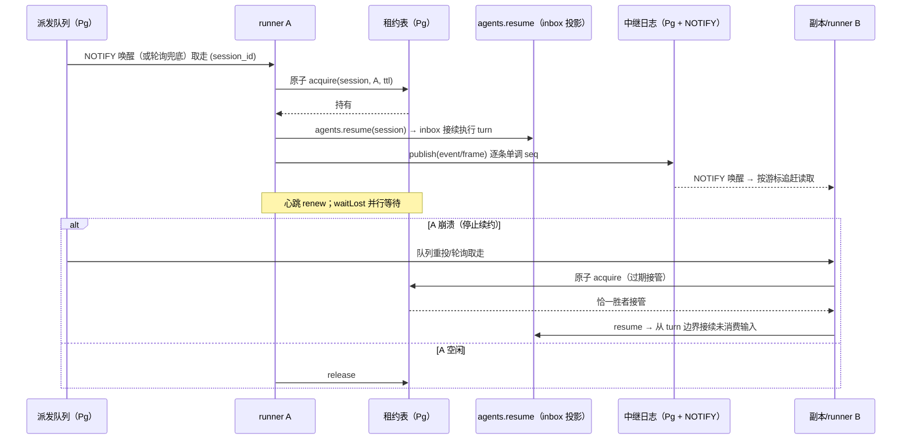
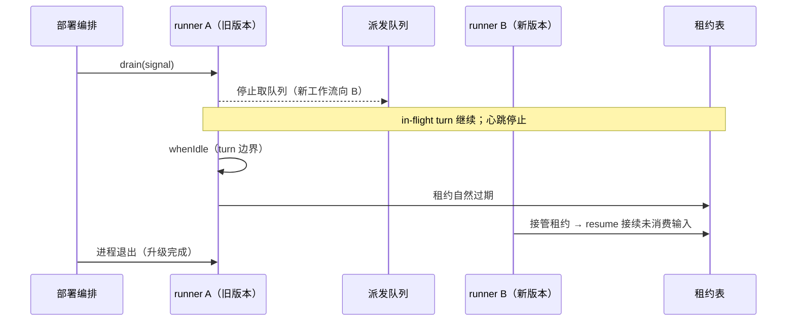

# core 系统地图（system-map）

> **逆向基线声明**：本文档是 brownfield-adopter（S33）逆向扫描产出的**现状快照**，不是权威意图文档。所有事实均可从代码与随仓文档验证；候选一律 `verified: false`（冻结字段，无升级入口）。扫描基线：`dsh` 0.2.1-alpha.1（`origin/master`，commit `5badb15009`），扫描日期 2026-10-06。

## 1. 系统定位

DeepSeek Harness（`dsh`）是 DeepSeek AI 开源的 agent harness，采用「一切皆插件」架构，构建于 Cordis 框架之上（`README.md`）。模型适配器、工具注册表、会话日志、agent loop 本身都是可替换插件，没有特权内核（`docs/architecture.md` §Cordis）。

## 2. 总体架构：profile/bundle 分层组合

一个运行中的 `dsh` 是启动时按序组合出的插件树。**profile** 是 Harness home 中的具名组合，声明其堆叠的 bundle、树外插件与用户 `cordis.patch.yml`；**bundle** 是 Cordis 配置行及其挂载代码的分发格式。层叠顺序：profile 列出的 bundle（按序）→ profile patch → home patch → `--patch` overlay（`docs/architecture.md` §Profiles and bundles）。

内置 profile：`web`、`headless`、`sdk`、`sdk-minimal`、`acp`；共享首层 `dsh-base`（模型适配器、工具、持久化、沙箱与审批策略、设置、凭证、遥测），`sdk-minimal` 是唯一不应用 `dsh-base` 的例外（`docs/architecture.md` §Profiles and bundles、§Application launch）。

## 3. 产品 API 脊柱（core/）

| 包 | 拥有 | ctx 键 |
|---|---|---|
| core/session | append-only `SessionEvent` 日志与内存存储 | `ctx.sessions` |
| core/system-prompt | 提示节与工具 schema 装配 | `ctx.systemPrompt` |
| core/tools | 作用域工具注册表与受护执行管线 | `ctx.tools` |
| core/agent | `Agent` 接口、活注册表与 `agent/*` 事件 | `ctx.agents` |
| core/agent-loop | 实现该接口的默认驱动 | `ctx.agentLoop` |
| core/scope | 按 agent 作用域注册原语 | 库，无键 |
| llm/llm | 消息/流词汇与适配器缝 | `ctx.llm` |
| webhook/webhook | 鉴权投递派发与 Workspace Session 创建 | `ctx.webhookRuntime` |

事实来源：`docs/architecture.md` §Core packages。

## 4. 能力缝（capability seam）全景

一个缝 = Service Definition + Service Provider + Consumer 三角色，缺一不可（`docs/architecture.md` §Capability seams）。当前在册的主要缝（`ctx.*` 服务键，证据见 packages/*/README.md 与 `docs/architecture.md`）：

- **执行域**：`ctx.fs`（文件系统）、`ctx.shell`（bash/pwsh）、`ctx.subprocess`（子进程）、`ctx.terminals`（持久 PTY）、`ctx.sandbox`（进程沙箱）、`ctx.ssh`（POSIX 远程）、`ctx.lsp`（语言服务器）、`ctx.ptcRuntime`（PTC 程序执行）。
- **模型域**：`ctx.llm`（LLM 适配）、`ctx.tokenMeter`（token 计量）、`ctx.web`（web 搜索/抓取）、`ctx.skills`（技能目录）、`ctx.compaction`（历史压缩）、`ctx.mcpResources`（MCP 资源）。
- **代理协作域**：`ctx.subagents`（子代理委派）、`ctx.workflowEngine`（工作流编排）、`ctx.jobs`（后台作业）、`ctx.agentTeams`（实验 Agent Teams）、`ctx.agentPresets`（预设组合）、`ctx.browserUse`/`ctx.computerUse`（浏览器/桌面操作）。
- **会话数据域**：`ctx.sessionPersistence`（持久化）、`ctx.sessionProjections`（投影）、`ctx.sessionQuery`（检索）、`ctx.sessionTitle`（标题）、`ctx.sessionTelemetry`（遥测）、`ctx.storage`（非会话存储）、`ctx.spillStore`（溢出）、`ctx.attachments`（附件）、`ctx.workspaceRegistry`（工作区）。
- **人机交互域**：`ctx.approval`（审批）、`ctx.userQuestions`（提问）、`ctx.permissionPresets`（权限预设）、`ctx.commands`（人类命令）、`ctx.goals`（目标）、`ctx.schedule`（定时提醒）、`ctx.planMode`（计划模式）。
- **宿主与配置域**：`ctx.settings`、`ctx.credentials`、`ctx.authorization`、`ctx.hmr`、`ctx.pluginManager`、`ctx.configEditor`、`ctx.officeToPdf`、`ctx.webhookRuntime`、`ctx.remote`（Typert RPC 网关）。

## 5. 事件域与 turn 流程

事件分三域：持久 **Session 事件**（`turn/*`、`step/*`、`system/message`、`user/message`、`assistant/*`、`tool/*`，追加进日志并广播）、活的 **Agent 事件**（`agent/*`，携带活 Agent）、**能力事件**（`fs/*`、`tools/*` 等，给缝挂策略与适配器）。一个 **step** = 一次模型请求 + 其工具调用；一个 **turn** = 零或多个 step。主链：`turn/start → agent/pre-step → step/start → agent/request → llm/stream → agent/assistant-stream → tool/call → tools/pre-execute → tools/execute → tools/post-execute → step/end → agent/turn-stopping → turn/end`。`agent/pre-step`、`agent/request`、`llm/stream`、`tools/*` 为瀑布事件，监听者必须 `next()` 委托。事实来源：`docs/architecture.md` §Events、§Turn flow。

## 6. 会话日志与投影

会话日志是模型所见上下文的唯一来源（`deriveMessages()` 投影模型历史；**模型可见 ⟺ 已落日志**）。格式代际：JSONL v0 用 `session.jsonl[.zstd]`，v1+ 用 `session.vN.jsonl[.zstd]`；已提交代际路径永不改名/替换/删除；`open` 选择数值最高的规范代际，拒绝未来版本，或经静态相邻迁移链解码一次；写打开先在旁发布最终版本命名的后继，源保持不变。投影缝 `ctx.sessionProjections`：注册单元增量折叠已提交事件，宿主读者经 `stateOf()` 读单一类型化状态。事实来源：`docs/architecture.md` §Session log、AGENTS.md「Pre-stable APIs and released Session data」。

## 7. 外围子系统

- **desktop-app**：Electron 桌面应用（`apps/desktop` 壳 + `apps/desktop-host` Node-mode 宿主），携带精确 dsh 生产运行时，拥有保留 profile `desktop`，经 Node IPC 注入 boot、就绪、致命错误与关机信号（`docs/architecture.md` §Desktop application）。
- **web-bff**：`api/` 组提供 Remote BFF 装配与 Typert RPC 网关（`ctx.remote`），Client 以类型化方法调用 Host 能力；`typert/` 组负责类型图生成、产物加载与运行时注册（`packages/README.md`）。
- **client-web**：`client/` 组（63 包）提供 Web GUI 浏览器半（会话、导航、设置、审批、文件访问等），`apps/web` 为 vite 构建入口，dist 由 `dsh web` 伺服（`packages/README.md`、agent 扫描）。
- **sdk-typescript**：`sdk/` 组，newline-delimited JSON-RPC stdio 协议 + TypeScript client/server（`packages/sdk/README.md`）。
- **sdk-python**：`python/sdk`（PyPI `deepseek-harness-sdk`）+ `python/sdk-runtime`（按平台打包 dsh CLI 的 runtime wheel，控制台脚本 `dsh`）（`python/sdk/README.md`、`python/sdk-runtime/pyproject.toml`）。
- **native-addons**：`native/` 的 `@deepseek-ai/node-addon-system`，导出 `./landlock-run`（Landlock 沙箱启动器）与 `./flock`（异步 POSIX flock），按平台 optionalDependencies 分发预编译包（`native/system/packages/entry/package.json`）。

## 8. 包全景统计

`packages/` 共 56 个 group、约 331 个 workspace 包（agent 扫描统计，0.2.1-alpha.1）；另含 `apps/` 4 应用、`python/` 2 包、`native/` 6 包。约 335 个包公开发布，20 个 private。group 全景与逐包职责见 `packages/README.md` 与各 group README；依赖图见生成物 `docs/module-graph.md`。

## 9. fleet 部署形态（user-fleet-gateway 引入）

单用户进程模型不变；fleet 在部署层新增两个进程侧组件，把「一机一进程」扩展为「一机多用户进程，进程间隔离」：

| 组件 | 职责 | 与既有组件的关系 |
|---|---|---|
| `dsh-gateway` | OIDC 认证反向代理：按网关会话身份把请求路由到对应用户 dsh Host 进程的 loopback 端口；跨用户访问在网关拒绝 | 叠加在既有 `--public-url`/`--trusted-host` 反向代理路径（S05）之上；现有启动令牌机制原样保留在网关内层，不出本机回环 |
| `dsh-fleet-manager` | 用户进程注册表：首次登录 spawn `dsh --profile web`（OS 分配端口）并注入该用户专属 `$DSH_HOME`；空闲回收、崩溃重启、并发上限 | 复用 `home-paths` 显式 home 能力与 python sdk-runtime「显式 home + 子进程管理」先例（S06） |

**隔离不变式**（本变更立下、后续变更须遵守的约束）：

1. **一用户一进程一 home**：用户间隔离边界 = OS 进程 + 文件系统目录；不把用户维度引入任何存储格式（共享存储属 M2 之后的里程碑）。
2. **启动令牌不出回环**：`?token=` 进程凭证仅在网关与本机用户进程之间传递；用户浏览器只持网关会话。
3. **授权在网关强制**：跨用户可达性由网关按会话归属判定；M1 威胁模型假设本机管理层（网关与 fleet 管理器的运行者）可信，用户进程仅经 loopback 接受网关转发。
4. **现有包语义零破坏**：web-app 启动仅新增「信任 loopback 网关转发头」配置项；anonymous-user-id 新增可选的 fleet 注入身份读取（审计归属，G1-4）。

**资源控制**：fleet 并发上限与空闲回收阈值是部署配置项（非硬编码常量），是控制多用户部署 CPU/内存占用的主旋钮；验收与冒烟执行以小上限、串行冒烟为默认策略。

## 10. 共享持久层（shared-persistence-backends 引入）

M2 在第 4 节三条持久化缝上各落一个共享 Postgres 后端，并把每用户命名空间从目录物理隔离升级为共享层内的命名空间隔离。核心缝签名（`SessionPersistence`、storage KV、`AttachmentStore`/`SpillStore`）零改动；新包均实现既有缝、以并列后端注册。

### 10.1 组件

| 组件 | 包 | 实现的缝 | 说明 |
|------|-----|---------|------|
| 会话世代 Postgres 后端 | `packages/session/session-persistence-postgres`（`@deepseek-ai/dsh-session-persistence-postgres`） | `SessionPersistence` | 元数据 + 代际指针在表，世代事件字节为代际行内的字节列；复用 `session-persistence` 导出的校验原语（`storage-contract.ts`）保证各后端拒绝行为一致 |
| 共享 KV 后端 | `packages/storage/storage-postgres`（`@deepseek-ai/dsh-storage-postgres`） | `StorageBackend.kv` | 与 `storage-sqlite` 并列注册（名 `'postgres'`）；表结构镜像 sqlite 后端的 `u_<unit>_<table>` 物化习惯，unit 版本戳同语义 |
| 共享附件后端 | `packages/attachment/attachment-postgres`（`@deepseek-ai/dsh-attachment-postgres`） | `AttachmentStore` | 最小实现 `imageLimits`/`validateImage`/`saveImage`/`readImage`；文件流与 request 投影保持缝默认拒绝 |
| 共享溢出后端 | `packages/spill/spill-postgres`（`@deepseek-ai/dsh-spill-postgres`） | `SpillStore` | `saveText` 落共享表，`SpillRef` 仍为后端自造不透明串 |
| 命名空间提供方 | `packages/storage/storage-domain`（既有包小改） | `DomainFacility` | 注入了 fleet 身份的进程把每个域 unit 的名字派生为用户专属命名空间名 |

驱动与测试基建：Postgres 客户端用纯 JS 驱动（`postgres`/postgres.js，不新增原生依赖，沿用 node:sqlite 同级的零编译惯例）；测试与 staging 用 `@embedded-postgres/linux-x64` 免 root 真实服务器二进制，二进制缺失时相关用例显式 skip（不假绿）。

### 10.2 DDL（会话世代，`SESSION_FORMAT_VERSION` 语义不变）

```sql
-- 会话头与代际指针（current_generation 单调，指向最新已提交世代）
CREATE TABLE IF NOT EXISTS sessions (
  id                 TEXT PRIMARY KEY,
  format_version     INTEGER NOT NULL,
  header             TEXT NOT NULL,            -- 物化头（lossless JSON）
  current_generation INTEGER NOT NULL DEFAULT 0,
  inherited_event_count INTEGER NOT NULL DEFAULT 0,
  created_at         BIGINT NOT NULL,          -- epoch 毫秒
  updated_at         BIGINT NOT NULL
);

-- 已提交世代：不可变行。(id, generation) 原子 INSERT 冲突即独占发布失败——
-- 对应 JSONL 的 fs.link(staged, current) EEXIST 语义
CREATE TABLE IF NOT EXISTS session_generations (
  id         TEXT NOT NULL REFERENCES sessions(id),
  generation INTEGER NOT NULL,
  bytes      BYTEA NOT NULL,                  -- 整代事件日志字节（与 JSONL 世代文件同构）
  PRIMARY KEY (id, generation)
);

-- 未物化尾：最新世代之后的写入（对应 JSONL 的 live tail）；读路径永不回读中断尾
CREATE TABLE IF NOT EXISTS session_tail (
  id    TEXT PRIMARY KEY REFERENCES sessions(id),
  bytes TEXT NOT NULL                          -- 半行中断以最后一行不含换行符表达
);
```

- **写式互斥**：写式打开在共享库上取会话级锁（`pg_try_advisory_lock(hashtext(id))`），close 释放；不新增原生依赖（JSONL 的跨进程 flock 由 node-addon 承担，Postgres 后端用库原语等价表达）。
- **崩溃恢复**：打开时尾的最后一行不含终止符即中断尾——读路径屏蔽，写式打开按既有 repair 语义截断合成收尾；已提交世代行永不改写。
- **revision token**：`<current_generation>:<tail 摘要>` 形式的后端自造串（`SessionPersistenceRevision` 品牌类型）。
- **独占发布**：`INSERT INTO session_generations` 主键冲突即 `JsonlGenerationTargetConflictError` 同族冲突；世代发布与指针推进在同一事务。

### 10.3 DDL（共享 KV）

```sql
-- 每 unit 一组表，命名与 storage-sqlite 对齐：u_<unit>_<table>
CREATE TABLE IF NOT EXISTS u_<unit>_<table> (
  key   TEXT PRIMARY KEY,
  value TEXT NOT NULL                        -- lossless JSON
);
CREATE TABLE IF NOT EXISTS u_<unit>___unit_meta (  -- unit 版本戳，version-mismatch 拒绝同 sqlite
  singleton INTEGER PRIMARY KEY CHECK (singleton = 1),
  version   INTEGER NOT NULL
);
```

### 10.4 DDL（附件/溢出）

```sql
-- 附件对象：属主命名空间内内容寻址；(namespace, sha256) 复合主键
CREATE TABLE IF NOT EXISTS attachment_objects (
  namespace TEXT NOT NULL,                   -- 默认命名空间或用户派生命名空间
  sha256    TEXT NOT NULL,                   -- <hex64>
  bytes     BYTEA NOT NULL,
  size      BIGINT NOT NULL,
  PRIMARY KEY (namespace, sha256)
);

-- 溢出文本：按属主会话分组，引用为自造不透明 id
CREATE TABLE IF NOT EXISTS spill_texts (
  namespace TEXT NOT NULL,
  ref       TEXT PRIMARY KEY,
  session_id TEXT NOT NULL,
  bytes     TEXT NOT NULL
);
```

### 10.5 每用户命名空间（G1-3 在共享层内成立）

- **注入点**：`DomainFacility`（提供方层）。进程环境注入 `DSH_FLEET_USER_ID`（M1 fleet 管理器已注入）时，每个域 unit 的名字派生为 `<unit>_u<摘要>` 形式的用户专属名（摘要为 subject 的确定性安全编码，满足 `UNIT_NAME_RE`，且避免与普通 unit 名冲突）；未注入时用原名（默认命名空间），行为与现状一致。
- **为何在 unit 名层而非 record key 层**：KV 契约约束 record key 匹配 `[a-zA-Z0-9_-]+`，subject 含 `.` 不能直接做键前缀；unit 名层派生同时让 global 槽位天然按用户分离（每命名空间独立 global），且对全部后端（sqlite/json/postgres/测试替身）统一生效，KV 后端与域实现零感知。
- **附件/溢出命名空间**：对象表以 `namespace` 列承载同一派生规则；引用 id 不透明，消费方无跨命名空间列举/寻址入口。
- **不变式**：命名空间只由提供方从注入身份派生，域 API 键空间在命名空间内闭合；无跨命名空间查询入口（对应需求 5.3 不做清单）。

### 10.6 契约与验收绑定

- `session-persistence-postgres` 必须跑通 `runPersistenceContract` / `runLiveWritePathContract`（`packages/session/session-persistence/tests/`），工厂提供 `{persistence, dispose, reopen, corruptTail}`——`reopen` 用新连接模拟第二节点（跨实例用例不再自跳过），`corruptTail` 向尾行注入半行 JSON。
- `storage-postgres` 以 `storage-domain` 的测试替身惯例对齐（内存/文件后端既有用例为参照），并覆盖双连接命名空间互不可见。
- 附件/溢出后端覆盖存取一致、not found、命名空间隔离。

## 11. 执行池（agent-runner-pool 引入）

M3 在第 10 节共享持久层之上落执行池：会话执行从每用户本地 Host 进程升级为可多副本、可接管的 runner 池。核心缝签名与 `agent-loop` 零改动——租约在「启动 Agent 前获取、丢失即 cancel」的外层实现；派发与中继全部落新 Service Definition 与新编排包。

### 11.1 组件

| 组件 | 包 | 实现的缝 | 说明 |
|------|-----|---------|------|
| 会话租约 Service Definition | `packages/core/session-lease`（`@deepseek-ai/dsh-session-lease`） | `ctx.sessionLease` | `acquire(sessionId, owner, ttl)` / `renew` / `release` / `ownerOf` / `waitLost`；对应 JSONL 后端 single-writer claim 的跨节点版（方案 B8），`agent-loop` 零感知 |
| 会话租约 Postgres Provider | `packages/core/session-lease-postgres`（`@deepseek-ai/dsh-session-lease-postgres`） | `ctx.sessionLease` | 租约表承载；获取与过期接管为同一条原子 `UPDATE`，并发恰一胜者 |
| 流中继 Service Definition | `packages/core/stream-relay`（`@deepseek-ai/dsh-stream-relay`） | `ctx.streamRelay` | `publish(sessionId, record)` / `subscribe(sessionId, fromSeq)`；record 为 `session/event` 或 assistant-stream 帧的序列化形态，按会话单调序号 |
| 流中继 Postgres Provider | `packages/core/stream-relay-postgres`（`@deepseek-ai/dsh-stream-relay-postgres`） | `ctx.streamRelay` | 中继日志表 + `LISTEN/NOTIFY` 唤醒 + 序号追赶；NOTIFY 仅作唤醒信号（载荷上限 8000 字节），记录本体走共享表。Redis pub/sub 为该缝的后续 Provider |
| 派发队列与 Runner 编排 | `packages/core/agent-dispatch`（`@deepseek-ai/dsh-agent-dispatch`） | `ctx.agentDispatch` | 队列表（会话 id 去重）+ `publish(sessionId)` + Runner 编排循环（取队列 → `sessionLease.acquire` → `agents.resume`（durable inbox 投影接续，B3）→ `waitLost` 即 `agent.cancel` → 空闲释放）；定义/提供者/消费者三层在本包闭环 |

既有包改动（小）：`packages/api/session-controller`——history/follow 数据面加 stream-relay 增量源（非属主副本冷读共享层后从 relay 追加 live 事件与 assistant-stream 基线，浏览器 follow 语义不变）。

驱动与测试基建：沿用 M2 的纯 JS `postgres` 驱动与 `@embedded-postgres/linux-x64` 免 root 真实服务器二进制，二进制缺失时相关用例显式 skip（不假绿）。

### 11.2 DDL（租约/队列/中继）

```sql
-- 会话租约：一行一会话；获取与过期接管为同一条原子 UPDATE
CREATE TABLE IF NOT EXISTS session_leases (
  session_id       TEXT PRIMARY KEY,
  owner_node       TEXT NOT NULL,
  lease_expires_at BIGINT NOT NULL,           -- epoch 毫秒
  acquired_at      BIGINT NOT NULL
);

-- 派发队列：会话 id 去重（唯一约束）；取走即删，重投可再入
CREATE TABLE IF NOT EXISTS agent_dispatch_queue (
  session_id  TEXT PRIMARY KEY,
  enqueued_at BIGINT NOT NULL
);

-- 流中继日志：每会话单调序号；NOTIFY 只唤醒，本体从表按序读取
CREATE TABLE IF NOT EXISTS stream_relay_log (
  session_id  TEXT NOT NULL,
  seq         BIGINT NOT NULL,
  kind        TEXT NOT NULL,                  -- 'session-event' | 'stream-frame'
  payload     TEXT NOT NULL,                  -- lossless JSON
  created_at  BIGINT NOT NULL,
  PRIMARY KEY (session_id, seq)
);
```

- **租约原子语义**：`UPDATE session_leases SET owner_node=$2, lease_expires_at=$3, acquired_at=$4 WHERE session_id=$1 AND (owner_node=$2 OR lease_expires_at < now_ms)`——行不存在时先 `INSERT ... ON CONFLICT DO NOTHING` 再走同条 UPDATE；并发获取/接管恰一胜者（`owner_node=$2` 覆盖自己续约/重取，`lease_expires_at < now` 覆盖过期接管）。
- **接管点不变式**：接管只允许 turn 边界——接管方经 `agents.resume` 从共享层重放会话日志 + durable inbox 投影接续（方案 §10 风险缓解：必经「源事件日志重放 + inbox 投影」）。
- **中继序号不变式**：`(session_id, seq)` 主键保证每会话序号严格单调；发布为单条 INSERT，序号由每会话行内自增（`SELECT max(seq)` 于同事务）。

### 11.3 Runner 编排时序



### 11.4 与既有件的关系

- **会话持久层（§10）**：Runner 的执行入口 `agents.resume` 即「从共享层加载会话」；中继的 `session/event` 记录源自 SessionStore 的既有事件（model-visible ⟺ logged 不变量不受影响——中继只搬运已落日志的事件）。
- **域命名空间（§10.5）**：租约/队列/中继表为部署级共享设施，不按用户派生命名空间（会话 id 已含归属：fleet 网关按用户路由后才会话才进入派发）。
- **fleet（§9）**：M1 网关按用户路由到本地 Host；M3 之后部署可选择把「执行」切到 runner 池（并列形态，未配置时行为与现状一致）。
- **终端/jobs 亲和他**：`sessionLease.ownerOf(sessionId)` 提供属主节点信息面；PTY 进程远程化与 Web/API 副本无状态化编排延后（5.3 不做清单）。

### 11.5 契约与验收绑定

- `session-lease-postgres` 覆盖：获取/续约/释放/属主查询、并发获取恰一胜者、过期接管恰一胜者、`waitLost` settle。
- `stream-relay-postgres` 覆盖：单调序号、双订阅者同帧序、游标追赶无缺口无重复、NOTIFY 丢失时轮询兜底。
- `agent-dispatch` 覆盖：入队去重、取走-重投、先租约后执行、`waitLost` → cancel → 释放、kill-runner 接管接续（turn 边界）。

## 12. Host 本地服务分布式化（distributed-host-services 引入）

M4 在执行池（§11）之上把 Host 本地服务升级为集群语义：schedule 到期计算移到共享库、webhook 入口无状态化、配置只读形态禁用 HMR、runner 排空支撑滚动升级。既有缝签名、`ScheduleService` 单机形态与 `agent-loop` 零改动——分布式 schedule 为并列 Provider，webhook 消费复用执行池原语。

### 12.1 组件

| 组件 | 包 | 实现的缝 | 说明 |
|------|-----|---------|------|
| 共享 schedule 派发 | `packages/schedule/schedule-dispatch`（`@deepseek-ai/dsh-schedule-dispatch`） | 并列 Provider（单机 `ScheduleService` 不变） | `schedule_due` 表（每任务一行、`next_due_at` 单调推进）+ `FOR UPDATE SKIP LOCKED` 恰一取用 + 租约约束投递；「重启后恢复」「仅补最近一次错过」由表行与 next-due 推进钉住（A6 只换触发器） |
| webhook 无状态入口 | `packages/webhook/webhook-ingress`（`@deepseek-ai/dsh-webhook-ingress`） | 并列 Provider（单机直接建会话形态不变） | `webhook_events` 表（去重键唯一）+ 签名校验入队 + `NOTIFY`；消费循环恰一取事件、建 Workspace Session、入执行池队列（A9 入口/执行解耦） |
| runner 排空 | `packages/core/agent-dispatch`（既有包小改） | `drain(signal)` | 停止取队列、停止租约心跳、等待 in-flight drive 到 turn 边界（`whenIdle`）后返回；滚动升级按会话粒度排空（§8-4） |
| HMR 只读禁用 | `packages/boot/hmr`（既有包小改） | 配置形态门 | `DSH_CONFIG_READONLY=1`（集群共享只读配置语义）时 fail-closed 拒绝启用（headless/SDK 先例，A10） |

驱动与测试基建：沿用 M2/M3 的纯 JS `postgres` 驱动与 `@embedded-postgres/linux-x64` 免 root 二进制，二进制缺失显式 skip（不假绿）。

### 12.2 DDL（schedule/webhook）

```sql
-- 共享 schedule：每任务一行；next_due_at 单调推进，交付与推进同事务
CREATE TABLE IF NOT EXISTS schedule_due (
  task_id      TEXT PRIMARY KEY,
  session_id   TEXT NOT NULL,
  prompt       TEXT NOT NULL,
  title        TEXT NOT NULL,
  next_due_at  BIGINT NOT NULL,              -- epoch 毫秒
  recurrence   TEXT NOT NULL,                -- 'once' | 'recurring'
  active       BOOLEAN NOT NULL DEFAULT TRUE,
  updated_at   BIGINT NOT NULL
);

-- webhook 入口事件：去重键唯一；消费恰一
CREATE TABLE IF NOT EXISTS webhook_events (
  dedupe_key   TEXT PRIMARY KEY,
  payload      TEXT NOT NULL,                -- lossless JSON（含 workspace/prompt 等建会话字段）
  state        TEXT NOT NULL DEFAULT 'pending',  -- 'pending' | 'done'
  created_at   BIGINT NOT NULL,
  consumed_at  BIGINT
);
```

- **SKIP LOCKED 取用不变式**：`SELECT … WHERE next_due_at <= now FOR UPDATE SKIP LOCKED` 在同一事务内取行、取会话租约、投递、推进 next-due、提交——并发 runner 恰一取用；崩溃回滚释放行锁，交付不丢。
- **next-due 推进不变式**：交付后 `next_due_at` 推进到首个严格未来匹配时刻（recurring）或标记完成（once）；连续错过多次仅交付最近一次错过的 occurrence——与单机「仅补最近一次错过的 recurring」逐条一致。
- **webhook 幂等不变式**：`dedupe_key` 主键使重复投递至多一行；消费事务内 `state='pending' → done` 与建会话同提交，崩溃回滚重新取用。
- **排空不变式**：drain 后 runner 不再进入取循环、心跳停止；in-flight drive 以 `whenIdle` 等待 turn 边界；租约自然过期由其他 runner 经既有接管路径（§11）接续。

### 12.3 排空与滚动升级时序



### 12.4 与既有件的关系

- **执行池（§11）**：schedule-dispatch 与 webhook 消费复用其租约原语与会话恢复路径；drain 是其编排方法。webhook 建会话后直接走既有派发队列。
- **共享持久层（§10）**：提醒投递与会话接续的日志读写全部经共享层；「升级后旧会话可打开」由会话代际 + 相邻迁移兜底（B2），本变更不新增任何会话格式版本。
- **fleet（§9）**：profile 镜像形态（固定层烘焙 + 用户层共享只读挂载）是 fleet 部署打包要求；`DSH_CONFIG_READONLY=1` 是其运行时声明，HMR 据此 fail-closed。

### 12.5 契约与验收绑定

- `schedule-dispatch` 覆盖：并发取用恰一、取用后崩溃不丢、recurring 仅补最近一次错过、全新进程无本地状态恢复、单机形态并存。
- `webhook-ingress` 覆盖：入队去重、消费恰一建会话、消费崩溃不丢、入口水平复制幂等。
- `agent-dispatch.drain` 覆盖：排空后新工作流向其余 runner、in-flight 到 turn 边界收尾、接管续跑。
- HMR 只读禁用：`DSH_CONFIG_READONLY=1` 下插件装配 fail-closed。

## 逆向基线来源
```yaml
candidates:
  - key: core::021e07d3146f
    anchor: service:ctx.jobs
    display: 后台作业注册表（jobs/jobs）
    state: active
    verified: false
    aliases: []
    superseded_by: []
    confirmed_by: null
    evidence: null
    confirmed_at: null
    retired_by: null
    retire_event_id: null
  - key: core::02643a928c63
    anchor: service:ctx.commands
    display: 人类命令注册表（interaction/commands）
    state: active
    verified: false
    aliases: []
    superseded_by: []
    confirmed_by: null
    evidence: null
    confirmed_at: null
    retired_by: null
    retire_event_id: null
  - key: core::05107c50958d
    anchor: subsystem:desktop-app
    display: Electron 桌面应用（apps/desktop + apps/desktop-host）
    state: active
    verified: false
    aliases: []
    superseded_by: []
    confirmed_by: null
    evidence: null
    confirmed_at: null
    retired_by: null
    retire_event_id: null
  - key: core::06175fd8fb38
    anchor: service:ctx.approval
    display: 用户审批缝（interaction/user-approval）
    state: active
    verified: false
    aliases: []
    superseded_by: []
    confirmed_by: null
    evidence: null
    confirmed_at: null
    retired_by: null
    retire_event_id: null
  - key: core::0660badfb2cd
    anchor: service:ctx.workflowEngine
    display: 工作流引擎缝（workflow/workflow）
    state: active
    verified: false
    aliases: []
    superseded_by: []
    confirmed_by: null
    evidence: null
    confirmed_at: null
    retired_by: null
    retire_event_id: null
  - key: core::10406063a879
    anchor: service:ctx.officeToPdf
    display: Office 转 PDF（document/office-to-pdf）
    state: active
    verified: false
    aliases: []
    superseded_by: []
    confirmed_by: null
    evidence: null
    confirmed_at: null
    retired_by: null
    retire_event_id: null
  - key: core::11d0adb61155
    anchor: subsystem:session-log-format
    display: 会话日志格式代际与相邻迁移链
    state: active
    verified: false
    aliases: []
    superseded_by: []
    confirmed_by: null
    evidence: null
    confirmed_at: null
    retired_by: null
    retire_event_id: null
  - key: core::13f360198e86
    anchor: service:ctx.storage
    display: 非会话存储枢纽（storage/storage）
    state: active
    verified: false
    aliases: []
    superseded_by: []
    confirmed_by: null
    evidence: null
    confirmed_at: null
    retired_by: null
    retire_event_id: null
  - key: core::15fea00ad242
    anchor: subsystem:sdk-python
    display: Python SDK 与运行时 wheel（python/）
    state: active
    verified: false
    aliases: []
    superseded_by: []
    confirmed_by: null
    evidence: null
    confirmed_at: null
    retired_by: null
    retire_event_id: null
  - key: core::1cc10e6e81bf
    anchor: service:ctx.agentTeams
    display: 实验 Agent Teams（experimental/agent-team）
    state: active
    verified: false
    aliases: []
    superseded_by: []
    confirmed_by: null
    evidence: null
    confirmed_at: null
    retired_by: null
    retire_event_id: null
  - key: core::2658738f165b
    anchor: service:ctx.credentials
    display: 凭证引用缝（credentials/credentials）
    state: active
    verified: false
    aliases: []
    superseded_by: []
    confirmed_by: null
    evidence: null
    confirmed_at: null
    retired_by: null
    retire_event_id: null
  - key: core::269a15963e32
    anchor: service:ctx.userQuestions
    display: 用户提问缝（interaction/user-questions）
    state: active
    verified: false
    aliases: []
    superseded_by: []
    confirmed_by: null
    evidence: null
    confirmed_at: null
    retired_by: null
    retire_event_id: null
  - key: core::2902d351a654
    anchor: service:ctx.skills
    display: 技能提供商注册表（skill/skill）
    state: active
    verified: false
    aliases: []
    superseded_by: []
    confirmed_by: null
    evidence: null
    confirmed_at: null
    retired_by: null
    retire_event_id: null
  - key: core::2cada473f047
    anchor: subsystem:client-web
    display: Web GUI 浏览器半（client/ + apps/web）
    state: active
    verified: false
    aliases: []
    superseded_by: []
    confirmed_by: null
    evidence: null
    confirmed_at: null
    retired_by: null
    retire_event_id: null
  - key: core::2fd6b579889b
    anchor: service:ctx.sessionQuery
    display: 会话检索服务（session-query/session-query）
    state: active
    verified: false
    aliases: []
    superseded_by: []
    confirmed_by: null
    evidence: null
    confirmed_at: null
    retired_by: null
    retire_event_id: null
  - key: core::351a7a4183d1
    anchor: subsystem:web-bff
    display: Web Remote BFF 与 Typert 类型图（api/ + typert/）
    state: active
    verified: false
    aliases: []
    superseded_by: []
    confirmed_by: null
    evidence: null
    confirmed_at: null
    retired_by: null
    retire_event_id: null
  - key: core::354c626213c6
    anchor: service:ctx.tokenMeter
    display: token 计量（llm/token-meter）
    state: active
    verified: false
    aliases: []
    superseded_by: []
    confirmed_by: null
    evidence: null
    confirmed_at: null
    retired_by: null
    retire_event_id: null
  - key: core::3fba2183f91d
    anchor: service:ctx.hmr
    display: 配置热重载（boot/hmr）
    state: active
    verified: false
    aliases: []
    superseded_by: []
    confirmed_by: null
    evidence: null
    confirmed_at: null
    retired_by: null
    retire_event_id: null
  - key: core::42be1a57a8f2
    anchor: service:ctx.computerUse
    display: 桌面操作提供商（computer-use）
    state: active
    verified: false
    aliases: []
    superseded_by: []
    confirmed_by: null
    evidence: null
    confirmed_at: null
    retired_by: null
    retire_event_id: null
  - key: core::442894cb8630
    anchor: service:ctx.spillStore
    display: 溢出存储缝（spill/spill）
    state: active
    verified: false
    aliases: []
    superseded_by: []
    confirmed_by: null
    evidence: null
    confirmed_at: null
    retired_by: null
    retire_event_id: null
  - key: core::463b854b8a9c
    anchor: service:ctx.subagents
    display: 子代理委派缝（subagent/subagent）
    state: active
    verified: false
    aliases: []
    superseded_by: []
    confirmed_by: null
    evidence: null
    confirmed_at: null
    retired_by: null
    retire_event_id: null
  - key: core::4748a8322328
    anchor: service:ctx.fs
    display: 文件系统能力缝（fs/fs）
    state: active
    verified: false
    aliases: []
    superseded_by: []
    confirmed_by: null
    evidence: null
    confirmed_at: null
    retired_by: null
    retire_event_id: null
  - key: core::4a95bb7df60d
    anchor: service:ctx.sandbox
    display: 进程沙箱缝（sandbox/sandbox）
    state: active
    verified: false
    aliases: []
    superseded_by: []
    confirmed_by: null
    evidence: null
    confirmed_at: null
    retired_by: null
    retire_event_id: null
  - key: core::4e48c0905c6e
    anchor: service:ctx.compaction
    display: 会话压缩缝（compaction/compaction）
    state: active
    verified: false
    aliases: []
    superseded_by: []
    confirmed_by: null
    evidence: null
    confirmed_at: null
    retired_by: null
    retire_event_id: null
  - key: core::512851fd6a19
    anchor: service:ctx.authorization
    display: 人机授权流程缝（credentials/authorization）
    state: active
    verified: false
    aliases: []
    superseded_by: []
    confirmed_by: null
    evidence: null
    confirmed_at: null
    retired_by: null
    retire_event_id: null
  - key: core::532d6c66d011
    anchor: service:ctx.terminals
    display: 持久 PTY 会话缝（terminal/terminal）
    state: active
    verified: false
    aliases: []
    superseded_by: []
    confirmed_by: null
    evidence: null
    confirmed_at: null
    retired_by: null
    retire_event_id: null
  - key: core::53d5da875440
    anchor: service:ctx.sessionTitle
    display: 会话标题服务（session/session-title）
    state: active
    verified: false
    aliases: []
    superseded_by: []
    confirmed_by: null
    evidence: null
    confirmed_at: null
    retired_by: null
    retire_event_id: null
  - key: core::54af594f9b64
    anchor: service:ctx.llm
    display: 提供商中立 LLM 服务缝（llm/llm）
    state: active
    verified: false
    aliases: []
    superseded_by: []
    confirmed_by: null
    evidence: null
    confirmed_at: null
    retired_by: null
    retire_event_id: null
  - key: core::5afcac64bfa4
    anchor: service:ctx.mcpResources
    display: MCP 资源读取（mcp/mcp-resources）
    state: active
    verified: false
    aliases: []
    superseded_by: []
    confirmed_by: null
    evidence: null
    confirmed_at: null
    retired_by: null
    retire_event_id: null
  - key: core::5b77621524b4
    anchor: service:ctx.systemPrompt
    display: 系统提示装配（core/system-prompt）
    state: active
    verified: false
    aliases: []
    superseded_by: []
    confirmed_by: null
    evidence: null
    confirmed_at: null
    retired_by: null
    retire_event_id: null
  - key: core::5e804c912622
    anchor: service:ctx.remote
    display: Typert RPC 网关（api/api-gateway）
    state: active
    verified: false
    aliases: []
    superseded_by: []
    confirmed_by: null
    evidence: null
    confirmed_at: null
    retired_by: null
    retire_event_id: null
  - key: core::608176717597
    anchor: service:ctx.agents
    display: Agent 接口与注册表（core/agent）
    state: active
    verified: false
    aliases: []
    superseded_by: []
    confirmed_by: null
    evidence: null
    confirmed_at: null
    retired_by: null
    retire_event_id: null
  - key: core::60c31c4bbab9
    anchor: service:ctx.settings
    display: 用户设置缝（settings/settings）
    state: active
    verified: false
    aliases: []
    superseded_by: []
    confirmed_by: null
    evidence: null
    confirmed_at: null
    retired_by: null
    retire_event_id: null
  - key: core::61196dbd321e
    anchor: service:ctx.webhookRuntime
    display: webhook 规则运行时（webhook/webhook）
    state: active
    verified: false
    aliases: []
    superseded_by: []
    confirmed_by: null
    evidence: null
    confirmed_at: null
    retired_by: null
    retire_event_id: null
  - key: core::61edb9433267
    anchor: layer:profile-bundle-composition
    display: profile/bundle 分层组合机制
    state: active
    verified: false
    aliases: []
    superseded_by: []
    confirmed_by: null
    evidence: null
    confirmed_at: null
    retired_by: null
    retire_event_id: null
  - key: core::6359a16f68af
    anchor: service:ctx.schedule
    display: Host 级定时提醒（schedule/schedule）
    state: active
    verified: false
    aliases: []
    superseded_by: []
    confirmed_by: null
    evidence: null
    confirmed_at: null
    retired_by: null
    retire_event_id: null
  - key: core::69d830e7f5fe
    anchor: service:ctx.ptcRuntime
    display: PTC 程序执行缝（ptc-runtime/ptc-runtime）
    state: active
    verified: false
    aliases: []
    superseded_by: []
    confirmed_by: null
    evidence: null
    confirmed_at: null
    retired_by: null
    retire_event_id: null
  - key: core::7597d2926b85
    anchor: service:ctx.planMode
    display: 计划模式状态（plan/plan-mode）
    state: active
    verified: false
    aliases: []
    superseded_by: []
    confirmed_by: null
    evidence: null
    confirmed_at: null
    retired_by: null
    retire_event_id: null
  - key: core::7cfc6f06dc56
    anchor: service:ctx.pluginManager
    display: 插件/bundle 管理（boot/plugin-manager）
    state: active
    verified: false
    aliases: []
    superseded_by: []
    confirmed_by: null
    evidence: null
    confirmed_at: null
    retired_by: null
    retire_event_id: null
  - key: core::80b5259de838
    anchor: service:ctx.agentPresets
    display: Agent 预设注册表（preset/agent-preset-registry）
    state: active
    verified: false
    aliases: []
    superseded_by: []
    confirmed_by: null
    evidence: null
    confirmed_at: null
    retired_by: null
    retire_event_id: null
  - key: core::9eb3a2f0ab80
    anchor: subsystem:native-addons
    display: node-addon-system 原生原语（native/）
    state: active
    verified: false
    aliases: []
    superseded_by: []
    confirmed_by: null
    evidence: null
    confirmed_at: null
    retired_by: null
    retire_event_id: null
  - key: core::a19f88cc5f7b
    anchor: service:ctx.attachments
    display: 附件存储缝（attachment/attachment）
    state: active
    verified: false
    aliases: []
    superseded_by: []
    confirmed_by: null
    evidence: null
    confirmed_at: null
    retired_by: null
    retire_event_id: null
  - key: core::a20453217bc9
    anchor: service:ctx.ssh
    display: POSIX SSH 远程助手（ssh/ssh）
    state: active
    verified: false
    aliases: []
    superseded_by: []
    confirmed_by: null
    evidence: null
    confirmed_at: null
    retired_by: null
    retire_event_id: null
  - key: core::b334b3677bb1
    anchor: pkg:vendor-cordis
    display: 内购 Cordis 框架（vendor/cordis）
    state: active
    verified: false
    aliases: []
    superseded_by: []
    confirmed_by: null
    evidence: null
    confirmed_at: null
    retired_by: null
    retire_event_id: null
  - key: core::bdeb72a0ca67
    anchor: service:ctx.configEditor
    display: 配置编辑（boot/config-editor）
    state: active
    verified: false
    aliases: []
    superseded_by: []
    confirmed_by: null
    evidence: null
    confirmed_at: null
    retired_by: null
    retire_event_id: null
  - key: core::c432a0e4e925
    anchor: service:ctx.workspaceRegistry
    display: 工作区实体注册表（workspace/workspace）
    state: active
    verified: false
    aliases: []
    superseded_by: []
    confirmed_by: null
    evidence: null
    confirmed_at: null
    retired_by: null
    retire_event_id: null
  - key: core::c9e42a987b53
    anchor: service:ctx.lsp
    display: 语言服务器能力缝（lsp/lsp）
    state: active
    verified: false
    aliases: []
    superseded_by: []
    confirmed_by: null
    evidence: null
    confirmed_at: null
    retired_by: null
    retire_event_id: null
  - key: core::cbaeb7f3b785
    anchor: service:ctx.web
    display: Web 搜索/抓取能力缝（web/web）
    state: active
    verified: false
    aliases: []
    superseded_by: []
    confirmed_by: null
    evidence: null
    confirmed_at: null
    retired_by: null
    retire_event_id: null
  - key: core::cd93ad775330
    anchor: service:ctx.sessionProjections
    display: 会话投影缝（session/session-projection）
    state: active
    verified: false
    aliases: []
    superseded_by: []
    confirmed_by: null
    evidence: null
    confirmed_at: null
    retired_by: null
    retire_event_id: null
  - key: core::cdb499ae1897
    anchor: pkg:@deepseek-ai/dsh-scope
    display: 按 agent 作用域注册原语（core/scope）
    state: active
    verified: false
    aliases: []
    superseded_by: []
    confirmed_by: null
    evidence: null
    confirmed_at: null
    retired_by: null
    retire_event_id: null
  - key: core::d12ac9fe2953
    anchor: service:ctx.tools
    display: 工具注册表与执行管线（core/tools）
    state: active
    verified: false
    aliases: []
    superseded_by: []
    confirmed_by: null
    evidence: null
    confirmed_at: null
    retired_by: null
    retire_event_id: null
  - key: core::d17ef4c3c644
    anchor: service:ctx.permissionPresets
    display: 权限预设（interaction/permission-presets）
    state: active
    verified: false
    aliases: []
    superseded_by: []
    confirmed_by: null
    evidence: null
    confirmed_at: null
    retired_by: null
    retire_event_id: null
  - key: core::d81d9f4cc412
    anchor: subsystem:sdk-typescript
    display: TypeScript SDK（sdk/）
    state: active
    verified: false
    aliases: []
    superseded_by: []
    confirmed_by: null
    evidence: null
    confirmed_at: null
    retired_by: null
    retire_event_id: null
  - key: core::e4e7f8f9380b
    anchor: service:ctx.sessionPersistence
    display: 会话持久化缝（session/session-persistence）
    state: active
    verified: false
    aliases: []
    superseded_by: []
    confirmed_by: null
    evidence: null
    confirmed_at: null
    retired_by: null
    retire_event_id: null
  - key: core::ec965cf194fc
    anchor: service:ctx.browserUse
    display: 浏览器操作提供商（browser-use）
    state: active
    verified: false
    aliases: []
    superseded_by: []
    confirmed_by: null
    evidence: null
    confirmed_at: null
    retired_by: null
    retire_event_id: null
  - key: core::f2f37ca478a2
    anchor: service:ctx.shell
    display: bash/pwsh 执行缝（shell/shell）
    state: active
    verified: false
    aliases: []
    superseded_by: []
    confirmed_by: null
    evidence: null
    confirmed_at: null
    retired_by: null
    retire_event_id: null
  - key: core::f92cc601418d
    anchor: service:ctx.subprocess
    display: 子进程管理缝（subprocess/subprocess）
    state: active
    verified: false
    aliases: []
    superseded_by: []
    confirmed_by: null
    evidence: null
    confirmed_at: null
    retired_by: null
    retire_event_id: null
  - key: core::faa81ac7b8e4
    anchor: service:ctx.sessions
    display: 会话事件溯源存储（core/session）
    state: active
    verified: false
    aliases: []
    superseded_by: []
    confirmed_by: null
    evidence: null
    confirmed_at: null
    retired_by: null
    retire_event_id: null
  - key: core::fad64b6f54c9
    anchor: subsystem:turn-flow
    display: turn/step 事件流与瀑布扩展点
    state: active
    verified: false
    aliases: []
    superseded_by: []
    confirmed_by: null
    evidence: null
    confirmed_at: null
    retired_by: null
    retire_event_id: null
  - key: core::fbc32314bd61
    anchor: service:ctx.goals
    display: 同会话目标状态（goal/goal）
    state: active
    verified: false
    aliases: []
    superseded_by: []
    confirmed_by: null
    evidence: null
    confirmed_at: null
    retired_by: null
    retire_event_id: null
  - key: core::fd596ef6e324
    anchor: service:ctx.sessionTelemetry
    display: 会话遥测后端缝（session/session-telemetry）
    state: active
    verified: false
    aliases: []
    superseded_by: []
    confirmed_by: null
    evidence: null
    confirmed_at: null
    retired_by: null
    retire_event_id: null
  - key: core::ffd616f8b753
    anchor: service:ctx.agentLoop
    display: 具体 agent loop 驱动（core/agent-loop）
    state: active
    verified: false
    aliases: []
    superseded_by: []
    confirmed_by: null
    evidence: null
    confirmed_at: null
    retired_by: null
    retire_event_id: null
```
