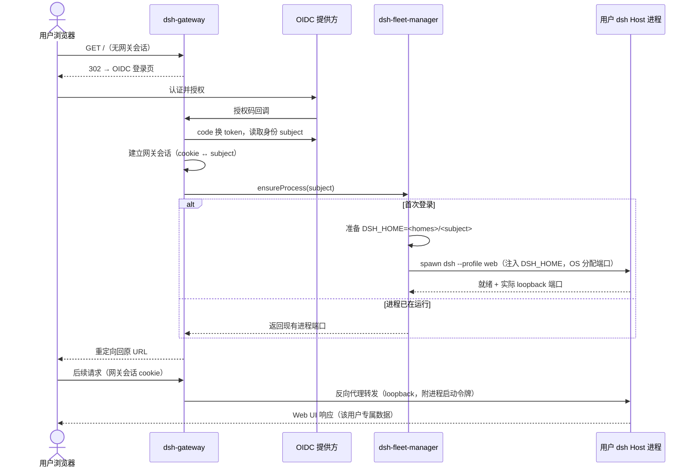

# core S31: 用户经认证网关登录并进入自己的 Harness（场景实现）

> 来源：变更 `user-fleet-gateway`（M1 User Fleet）。场景定义见 `core-01-requirements.md` §S31；交互规格见 `core-01-feature-design.md` §4。

## 1. 参与者

| 参与者 | 职责 |
|---|---|
| 用户浏览器 | 发起访问，持网关会话 cookie |
| dsh-gateway | OIDC 认证、网关会话管理、按身份路由到用户进程 |
| OIDC 提供方 | 外部身份提供方（登录页与令牌签发由其承载） |
| dsh-fleet-manager | 用户进程注册表：开通/复用/回收用户专属 dsh Host 进程 |
| 用户 dsh Host 进程 | 该用户专属 `dsh --profile web`，独立 `$DSH_HOME`，仅监听 loopback |

## 2. 主路径时序（首次登录自动开通）

要点：

1. **进程凭证不出回环**：启动令牌仅存在于 gateway ↔ Host 进程之间；浏览器只持网关会话 cookie。
2. **开通是懒式的**：fleet 管理器只在用户实际登录时拉起进程；不预建全部用户。
3. **S01 语义不变**：用户进程内的一切（会话列表、设置、审批）与单机 `dsh web` 完全一致。

## 3. 异常流

| 异常 | 行为 |
|---|---|
| OIDC 认证失败/用户拒绝授权 | 网关返回明确未认证反馈；不为该用户拉起任何进程（S31-AC-02） |
| OIDC 发现/令牌交换失败 | fail-loud：网关启动或请求时给出明确错误，不静默降级为匿名放行 |
| 用户进程启动失败（端口/home 异常） | fleet 管理器记录结构化错误并返回明确失败反馈；按重启策略重试有上限，不无限重试 |
| 网关会话过期 | 后续请求重新走 OIDC 重定向 |

## 4. 验收条件映射

| AC | 来源 | 覆盖测试 |
|---|---|---|
| S31-AC-01 正常：首次登录自动开通 | 需求文档 §S31 | ST-S31-01、UT-S31-02 |
| S31-AC-02 异常：认证失败不开通 | 需求文档 §S31 | ST-S31-02、UT-S31-01 |
