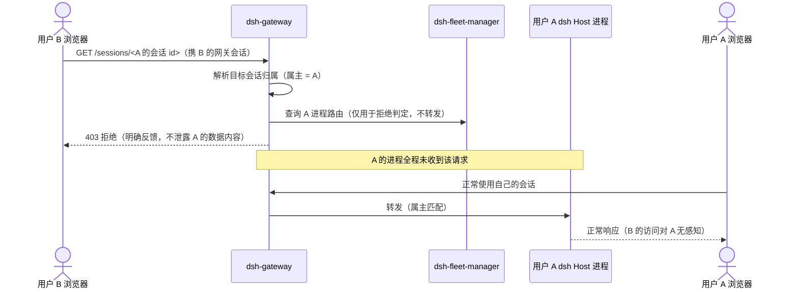

# core S32: 跨用户数据不可达（场景实现）

> 来源：变更 `user-fleet-gateway`（M1 User Fleet）。场景定义见 `core-01-requirements.md` §S32；交互规格见 `core-01-feature-design.md` §4。

## 1. 参与者

| 参与者 | 职责 |
|---|---|
| 用户 B 浏览器 | 发起跨用户访问尝试 |
| 用户 A 浏览器 | 属主会话在线（接收审批卡等投递） |
| dsh-gateway | 会话归属判定：只把请求路由到属主进程；跨用户请求在此拒绝 |
| A / B 的 dsh Host 进程 | 各自独立 loopback 进程 + 独立 `$DSH_HOME`，物理上不含对方数据 |

## 2. 主路径时序（B 访问 A 的会话 URL 被拒）

要点：

1. **两层隔离叠加**：网关按会话归属路由（逻辑隔离）+ 每用户独立进程与 home（物理隔离）。B 即使绕过网关直接扫描端口，连到的也是自己无令牌的拒绝（用户进程仅接受持启动令牌的回环转发）。
2. **数据零共享**：A 的会话、附件、凭证、设置全部在 A 的 home 目录内；B 的进程从未挂载该目录。
3. **审批投递按连接归属**：审批/提问事件只投递到属主用户的浏览器连接。

## 3. 异常流（隔离属性）

| 异常 | 行为 |
|---|---|
| B 访问 A 的会话/附件/设置 URL | 网关 403，明确反馈，不泄露数据（S32-AC-01） |
| A 会话待审批，B 在线 | 审批卡只出现在 A 的浏览器；B 不可见、不可代答（S32-AC-02） |
| B 直连 A 进程端口（绕过网关） | 连接被拒（非回环来源或无启动令牌），fail-closed |

## 4. 验收条件映射

| AC | 来源 | 覆盖测试 |
|---|---|---|
| S32-AC-01 正常：跨用户访问被拒 | 需求文档 §S32 | ST-S32-01、UT-S32-01 |
| S32-AC-02 异常：审批路由隔离 | 需求文档 §S32 | ST-S32-02、UT-S32-02 |
