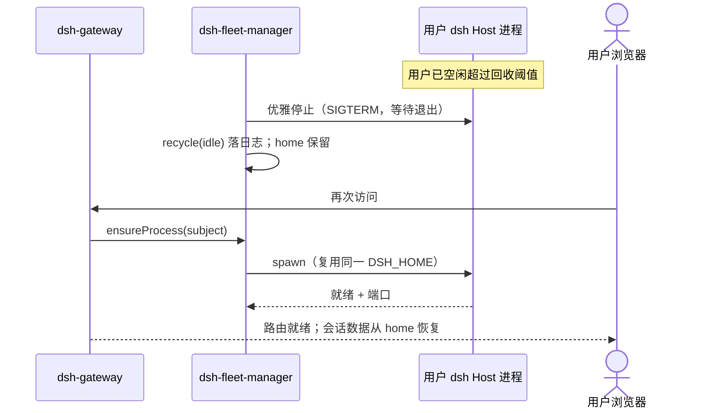
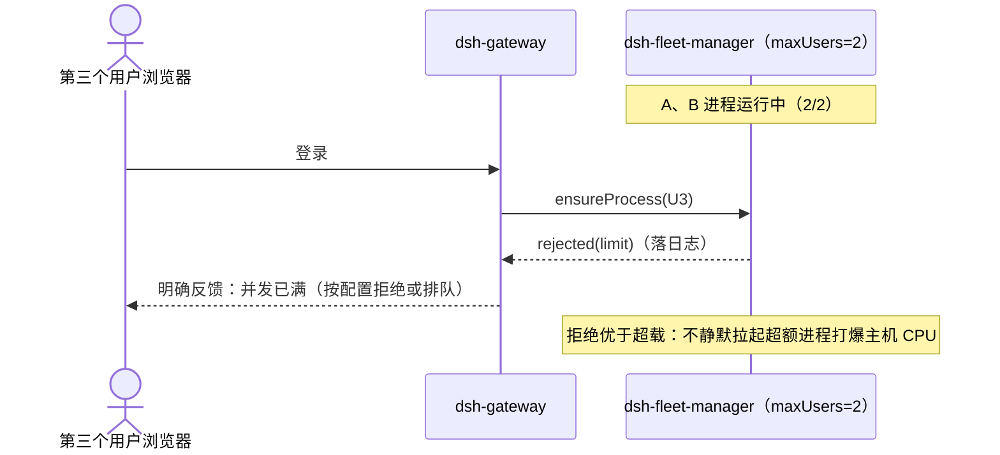

# core S33: fleet 用户进程生命周期（场景实现）

> 来源：变更 `user-fleet-gateway`（M1 User Fleet）。场景定义见 `core-01-requirements.md` §S33；交互规格见 `core-01-feature-design.md` §4。

## 1. 参与者

| 参与者 | 职责 |
|---|---|
| dsh-fleet-manager | 生命周期唯一管理者：开通、空闲回收、崩溃重启、并发上限裁决 |
| 用户 dsh Host 进程（×N） | 每用户一个；独立 `$DSH_HOME`；仅 loopback |
| dsh-gateway | 登录时调用 ensureProcess；请求路由依赖 fleet 管理器的进程注册表 |
| 运维 | 经部署配置调整上限/阈值；经结构化日志观测 |

## 2. 状态与生命周期事件

用户进程状态机：`absent → starting → ready ⇄ busy → idle →(超时)→ absent`；`ready/busy →(崩溃)→ restarting → ready`。

生命周期事件全部落 fleet 管理器结构化日志：`provisioned` / `recycled(idle)` / `restarted(crash)` / `rejected(limit)`。

## 3. 主路径时序（空闲回收后重新开通）

## 4. 并发上限与资源控制时序

要点：

1. **并发上限是 CPU 控制主旋钮**：同时存活的用户进程数 ≤ 配置上限；验收与冒烟在 staging 以小上限执行、冒烟串行，保证验收执行不打爆 CPU（用户验收要求）。
2. **回收保留数据**：空闲回收只终止进程，不动 home 目录；重新开通后会话完整恢复。
3. **崩溃隔离**：重启策略只作用于崩溃用户自己的进程；其余用户进程不受影响（ST-S33-02）。
4. **上限行为显式化**：达到上限的拒绝（或排队）是明确反馈并落日志，不静默超载。

## 5. 异常流

| 异常 | 行为 |
|---|---|
| 用户进程崩溃 | fleet 管理器 restarted(crash)；重启次数有上限，连续失败转为明确错误并落日志 |
| 优雅停止超时 | 升级为强杀（SIGKILL）；home 数据由会话日志代际制保证一致性（只追加、崩溃可恢复） |
| 达并发上限 | rejected(limit)：明确反馈 + 落日志；不静默超载 |
| home 目录不可创建/不可写 | 开通失败 fail-loud，明确报错，不创建半可用进程 |

## 6. 验收条件映射

| AC | 来源 | 覆盖测试 |
|---|---|---|
| S33-AC-01 正常：首次登录开通、空闲回收后恢复 | 需求文档 §S33 | ST-S33-01、UT-S33-01 |
| S33-AC-02 异常：崩溃重启且用户间隔离 | 需求文档 §S33 | ST-S33-02、UT-S33-02 |
| S33-AC-03 资源约束：并发上限受控、验收执行 CPU 不超阈 | 用户验收要求 | ST-S33-03、UT-S33-03 |
