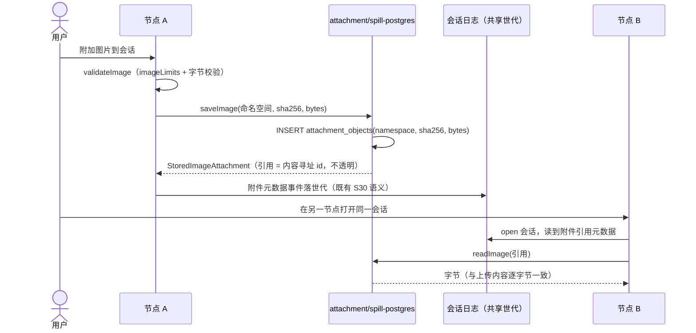

# core S36: 附件与溢出的共享存取（场景实现）

> 来源：变更 `shared-persistence-backends`（M2 共享持久层）。场景定义见 `core-01-requirements.md` §S36；交互规格见 `core-01-feature-design.md` §5。

## 1. 参与者

| 参与者 | 职责 |
|---|---|
| 节点 A / 节点 B | 两个 dsh Host 进程（同一用户、同一命名空间，指向同一共享库） |
| attachment-postgres | `AttachmentStore` 后端：图像校验、内容寻址存取（`imageLimits`/`validateImage`/`saveImage`/`readImage`） |
| spill-postgres | `SpillStore` 后端：`saveText` 落共享表，返回自造不透明引用 |
| 会话日志 | 附件/溢出引用的元数据随会话事件落日志（model-visible ⟺ logged 不变） |

## 2. 主路径时序（跨节点取回一致）

要点：

1. **引用不变**：引用仍是后端自造不透明 id（内容寻址），消费方不解析、不感知介质；会话日志仍是重建会话视图的唯一来源。
2. **命名空间随属主**：对象表以命名空间列承载；读取按引用直达属主数据，无跨命名空间列举入口。
3. **最小实现面**：图像存取先落地；文件流/request 投影按缝默认拒绝，后续按需补齐。

## 3. 异常流

| 异常 | 行为 |
|---|---|
| 引用键不存在 | 明确 not found 失败，不返回空字节（S36-AC-02） |
| 图片超出 imageLimits / 校验失败 | 拒绝保存，错误事实返回给会话（复用缝校验语义） |
| 溢出会话缺失 owner | `saveText` 要求 owner.sessionId，缺失即拒绝（缝签名约束） |
| 共享库不可达 | 保存/读取明确失败；会话内表现为工具失败事实，不静默吞掉 |

## 4. 验收条件映射

| AC | 来源 | 覆盖测试 |
|---|---|---|
| S36-AC-01 正常：跨节点取回一致 | 需求文档 §S36 | ST-S36-01、UT-S36-01 |
| S36-AC-02 异常：缺失键明确报错 | 需求文档 §S36 | UT-S36-02 |
