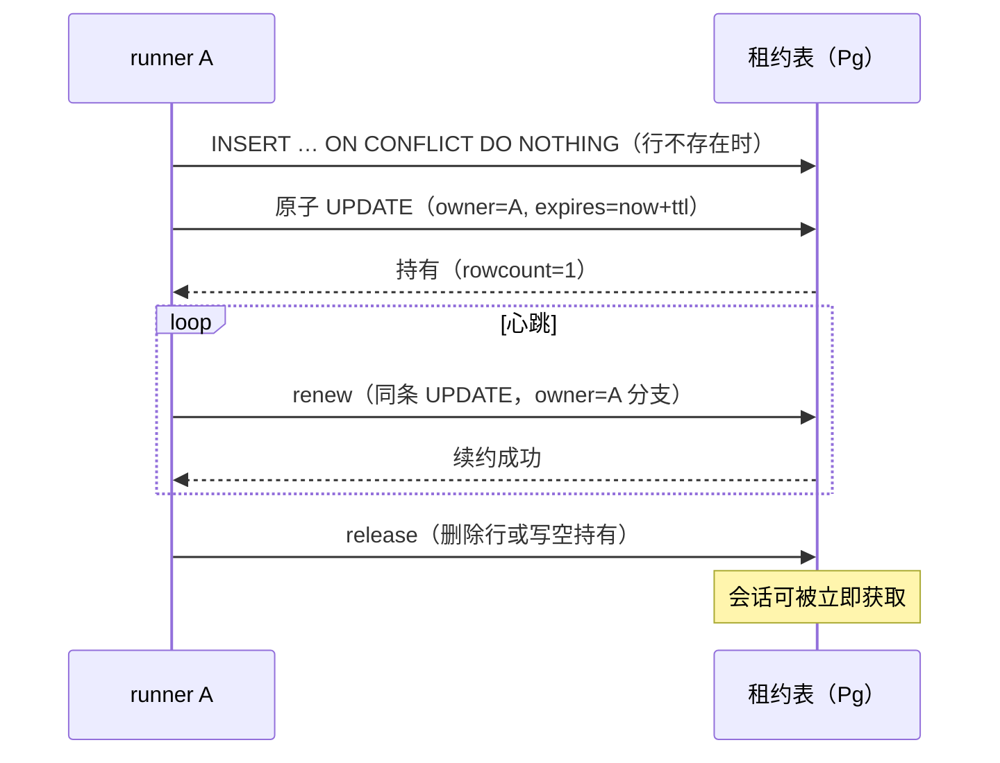

# core S37: 会话租约的跨节点单写者（场景实现）

> 来源：变更 `agent-runner-pool`（M3 执行池）。场景定义见 `core-01-requirements.md` §S37；交互规格见 `core-01-feature-design.md` §6。

## 1. 参与者

| 参与者 | 职责 |
|---|---|
| runner A / runner B | 执行池中的两个 runner 进程，竞争同一会话的执行权 |
| session-lease-postgres | `sessionLease` 缝的 Postgres Provider：租约表原子仲裁 |
| 共享 Postgres | 租约行的承载与原子 UPDATE 仲裁 |

## 2. 主路径时序（获取-续约-释放）

## 3. 异常流

| 异常 | 行为 |
|---|---|
| B 在 A 持有期间获取 | 原子 UPDATE 命中 0 行 → 明确占用失败（含持有者与到期时刻）；无双持有者（S37-AC-02） |
| A、B 并发获取空闲租约 | 同条 UPDATE 串行化，恰一 rowcount=1；败者占用失败（S37-AC-02） |
| A 崩溃停止续约 | 租约行停留至过期；B 的获取命中 `lease_expires_at < now` 分支 → 原子接管恰一胜者；A 侧 `waitLost` settle → 外层 `agent.cancel()`（S37-AC-03） |
| 接管后的执行恢复 | 接管方不经任何内存状态：`agents.resume` 从共享层重放 + inbox 投影接续，接管点为 turn 边界 |

## 4. 验收条件映射

| AC | 来源 | 覆盖测试 |
|---|---|---|
| S37-AC-01 正常：获取-续约-释放 | 需求文档 §S37 | UT-S37-01、ST-S37-01 |
| S37-AC-02 异常：竞争恰一胜者 | 需求文档 §S37 | UT-S37-02、ST-S37-02 |
| S37-AC-03 异常：过期接管与丢失通知 | 需求文档 §S37 | UT-S37-03、UT-S37-04、ST-S37-03 |
