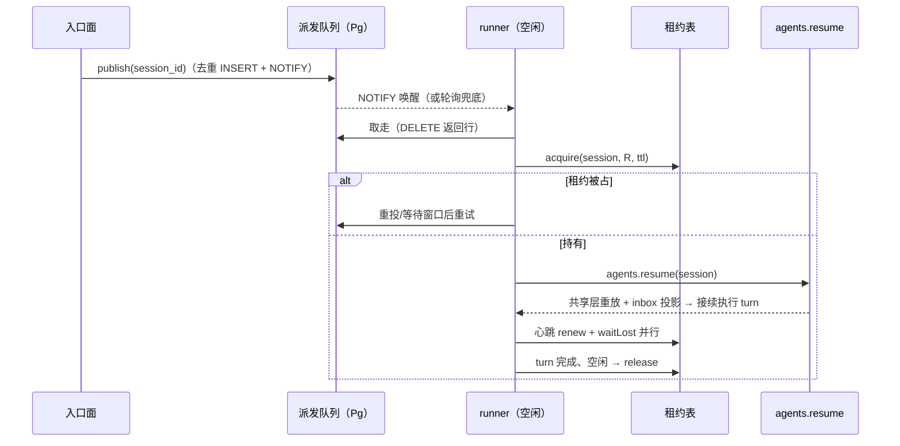

# core S38: 队列派发与 inbox 投影接续（场景实现）

> 来源：变更 `agent-runner-pool`（M3 执行池）。场景定义见 `core-01-requirements.md` §S38；交互规格见 `core-01-feature-design.md` §6。

## 1. 参与者

| 参与者 | 职责 |
|---|---|
| 入口面（网关/webhook/用户消息） | 调用 `agentDispatch.publish(sessionId)` 投递派发 |
| agent-dispatch 队列 | 会话 id 去重的派发队列表 + NOTIFY 唤醒 + 轮询兜底 |
| runner 编排循环 | 取队列 → 取租约 → `agents.resume` → `waitLost` 即 cancel → 空闲释放 |
| session-lease-postgres | 会话单写者仲裁（S37） |
| 共享持久层 + durable inbox | 会话日志与未消费输入的恢复源 |

## 2. 主路径时序（派发接续）

## 3. 异常流

| 异常 | 行为 |
|---|---|
| runner A 执行中被 kill | 租约停留至过期；队列重投（或他 runner 轮询）→ B 过期接管 → resume 从 turn 边界接续 inbox 未消费输入，无重复副作用（S38-AC-02） |
| 双 runner 同时取到同一会话派发 | 各自 acquire——恰一持有执行，另一等待/回队（S38-AC-03，由 S37 租约排除） |
| NOTIFY 丢失 | 轮询兜底保证派发项不滞留 |
| 租约丢失（被接管） | `waitLost` settle → `agent.cancel()` → 释放并按需重新入队 |

## 4. 验收条件映射

| AC | 来源 | 覆盖测试 |
|---|---|---|
| S38-AC-01 正常：派发接续 | 需求文档 §S38 | UT-S38-01、ST-S38-01 |
| S38-AC-02 异常：崩溃后其他节点接续 | 需求文档 §S38 | UT-S38-03、ST-S38-02 |
| S38-AC-03 异常：双 runner 竞争被排除 | 需求文档 §S38 | UT-S38-02、ST-S38-03 |
