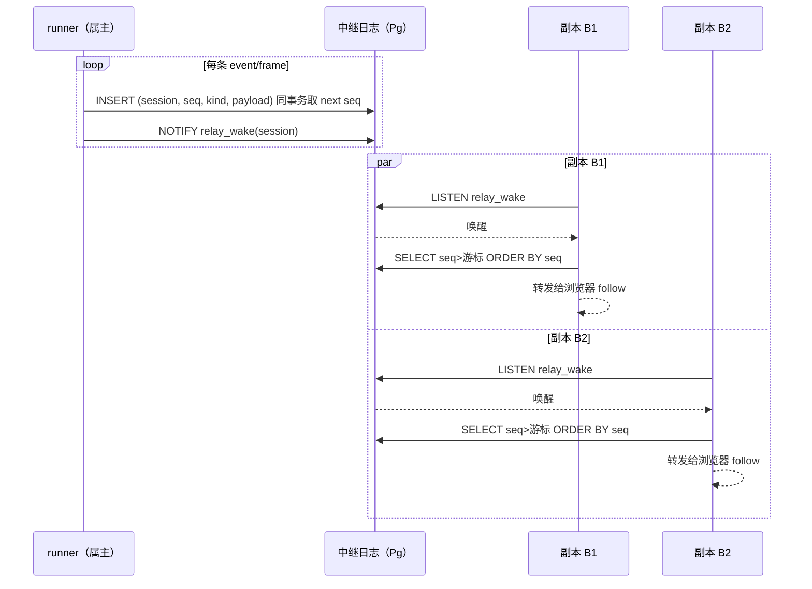

# core S39: 流中继的跨副本实时（场景实现）

> 来源：变更 `agent-runner-pool`（M3 执行池）。场景定义见 `core-01-requirements.md` §S39；交互规格见 `core-01-feature-design.md` §6。

## 1. 参与者

| 参与者 | 职责 |
|---|---|
| runner（属主） | 执行会话；把 `session/event` 与 assistant-stream 帧发布到中继 |
| stream-relay-postgres | `streamRelay` 缝的 Provider：中继日志表 + LISTEN/NOTIFY 唤醒 + 序号追赶 |
| Web/API 副本 ×2 | 非属主副本：冷读共享层 + 从中继追赶 live 增量，向浏览器 follow 转发 |

## 2. 主路径时序（双副本同看流）

要点：

1. **序号单调**：`(session_id, seq)` 主键，发布方在同事务内取每会话 `max(seq)+1`，并发发布串行化。
2. **NOTIFY 仅唤醒**：通知载荷只含会话标识（PostgreSQL 8000 字节载荷上限），记录本体从表按序读取——大事件不受限。
3. **游标追赶**：订阅者携带已读最大序号，从 `seq > 游标` 完整回放；中途订阅与断线重连同路。
4. **语义不变**：中继只搬运既有事件/帧的序列化形态；副本侧 Session-follow 语义不变。

## 3. 异常流

| 异常 | 行为 |
|---|---|
| 副本中途才订阅 | 以冷读游标订阅 → 中继从游标之后完整回放，无缺口无重复（S39-AC-02） |
| NOTIFY 丢失（副本错过唤醒） | 轮询兜底 + 订阅时的即时追赶查询保证不滞留 |
| 发布方崩溃 | 已发布记录持久在中继表；接管 runner 继续追加，序号延续 |

## 4. 验收条件映射

| AC | 来源 | 覆盖测试 |
|---|---|---|
| S39-AC-01 正常：双副本同看流 | 需求文档 §S39 | UT-S39-01、ST-S39-01 |
| S39-AC-02 异常：游标追赶 | 需求文档 §S39 | UT-S39-02、ST-S39-02 |
