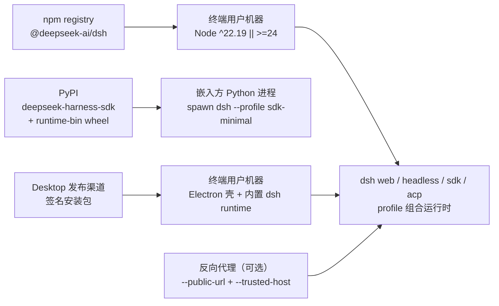
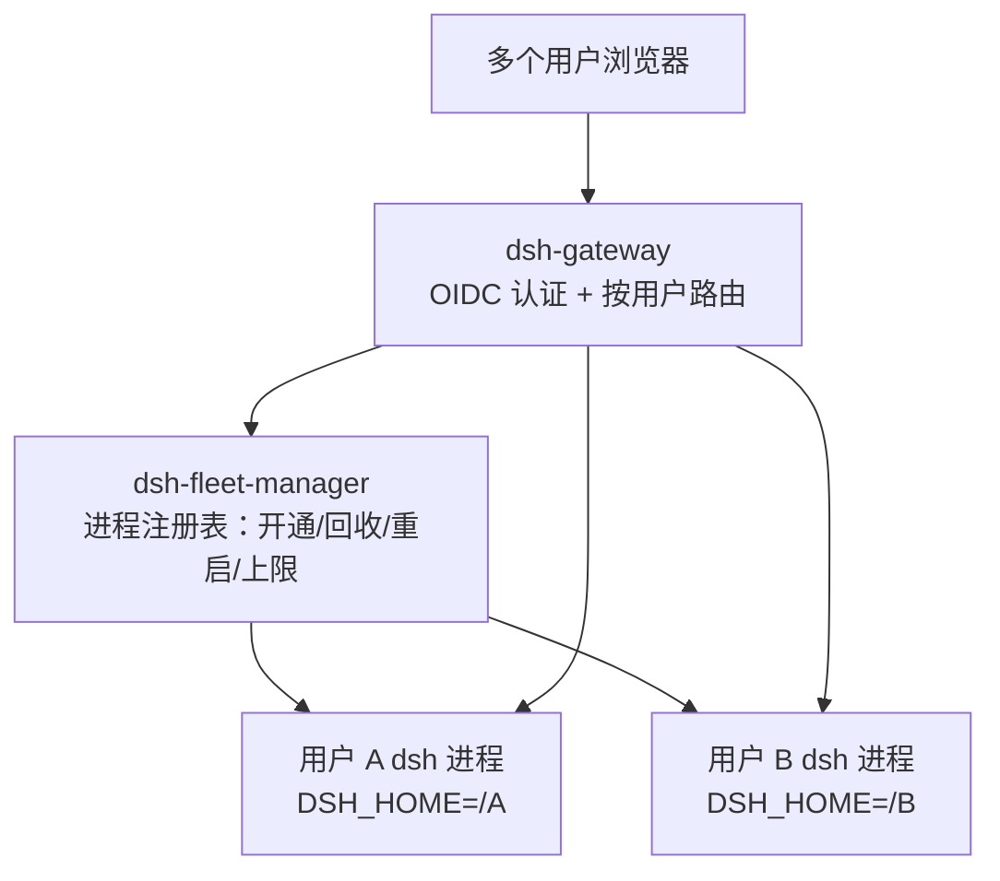
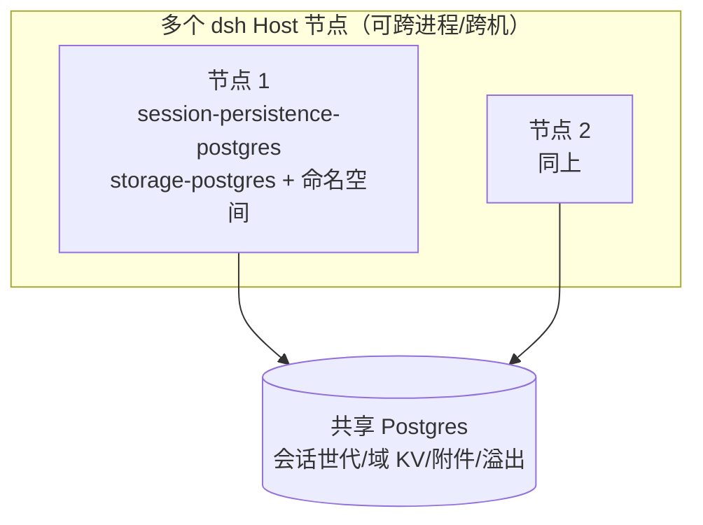

# core-01-deployment-plan

> 最后更新：2026-10-07
> 文档性质：存量项目逆向整理的部署基线，描述 0.2.1-alpha.1 已存在的分发/安装/发布路径与部署后检查项。本方案只设计不执行；部署执行与 smoke 属 Phase 3-7/3-8 人类确认点。

## 一、部署目标

dsh 是本地/自托管优先的 Node 应用集合，无托管服务端。「部署」在此等价于**把可运行产物交付到目标机器并验证可用**：

- npm 主包 `@deepseek-ai/dsh`（`apps/cli`，bin `dsh`）→ 终端用户经 `npx @deepseek-ai/dsh web` 运行。
- Web 前端 `apps/web`（vite dist）随 `dsh web` 伺服，不独立部署。
- Desktop 安装包（Electron，`apps/desktop`，签名与公证后发布）。
- Python SDK：`deepseek-harness-sdk` + 平台 runtime wheel（`deepseek-harness-runtime-bin`）→ PyPI。
- 插件生态：终端用户经 `dsh plugin` 向 profile 安装 npm 包。

## 二、部署拓扑

**fleet 形态拓扑（user-fleet-gateway 起，多用户自托管部署）**：

- fleet 是**新增部署形态**，与既有单用户拓扑并存：单用户路径（`dsh web` 直启、`--public-url` 反代）行为不变。
- fleet 组件为部署侧新组件（`dsh-gateway`、`dsh-fleet-manager`），每用户 dsh 进程仍由既有 profile 组合启动。

**共享持久层拓扑（shared-persistence-backends 起，fleet 可选扩展）**：

- 共享持久层是 fleet 的**可选并列后端**：未配置时全部数据仍在每用户 `$DSH_HOME` 本地（JSONL/SQLite/local 附件），行为不变；配置共享 Postgres 后，会话世代、域 KV、附件/溢出落在共享库，任一节点可打开同一用户历史会话。
- staging 验证用 `@embedded-postgres/linux-x64` 免 root 真实 Postgres 二进制起共享库；不需要 root 或系统服务。

事实来源：`README.md`（Run from npm）、`docs/architecture.md` §Application launch/§Desktop application、`python/sdk-runtime/pyproject.toml`；fleet 形态见变更 `user-fleet-gateway` 提案与系统地图 §9；共享持久层见系统地图 §10。

## 三、环境变量与密钥

| 项 | 来源 | 用途 |
|---|---|---|
| `DEEPSEEK_API_KEY` / `DEEPSEEK_BASE_URL` | 进程环境或根 `.env` | 真实模型调用（e2e/演示；无 key 自跳过） |
| 用户 API key | `$DSH_HOME/.credentials.yaml`（经 settings 引用） | 会话模型调用；设置中仅存凭证引用 |
| `DSH_GITHUB_WEBHOOK_SECRET` | 部署 overlay 配置 | `/github` webhook 签名校验 |
| `HTTPS_PROXY`/`NO_PROXY`/`NODE_EXTRA_CA_CERTS` | 进程环境 | 代理网络与企业 TLS 拦截（`docs/user/guide/network-proxy.md`） |
| Windows 打包/签名密钥 | 发布者本地（EV 签名，见 `apps/desktop/README.md`） | Desktop 安装包签名 |
| OIDC issuer / client id / client secret | fleet 部署配置 | 网关认证（外部 OIDC 提供方） |
| fleet 用户 home 根目录 | fleet 部署配置 | 每用户 `$DSH_HOME` 的分配根（如 `<data>/homes/<subject>`） |
| fleet 并发上限 / 空闲回收阈值 / CPU 阈值 | fleet 部署配置（Config 字段，非硬编码） | 资源控制主旋钮：限制同时存活的用户进程数；staging 验收取小上限 |
| 共享 Postgres 连接串 | 部署配置（cordis.yml 配置字段） | `session-persistence-postgres` / `storage-postgres` / `attachment-postgres` / `spill-postgres` 指向共享库；缺失时各缝走本地默认后端，行为不变 |
| `DSH_FLEET_USER_ID` | fleet 管理器注入用户进程环境（M1 既有） | storage-domain 提供方派生每用户命名空间；未注入时走默认命名空间（单机行为不变） |

密钥原则：仓库内永不提交凭证；设置与日志只存凭证引用（`packages/credentials/`）。OIDC client secret 属部署密钥，同样不入库；共享 Postgres 连接串如含口令亦属部署密钥，只进部署配置不入库。

## 四、构建与发布命令

| 步骤 | 命令 | 事实来源 |
|---|---|---|
| 安装依赖 | `pnpm install`（node ^22.19 \|\| >=24） | `AGENTS.md` |
| 全量构建 | `pnpm run build`（tsc → lib/types；tsdown → runtime bundle） | `AGENTS.md` |
| 本地源码启动 | `pnpm dsh web` / `pnpm run dev:web` / `make web\|desktop` | `AGENTS.md`、`README.md` |
| 单元/覆盖门禁 | `pnpm run test` / `test:coverage`（per-file 100%） | `AGENTS.md`、`docs/testing.md` |
| 发布序列 | release 提交 + 版本 tag（如 `release(dsh): 0.2.1-alpha.1`） | git log 中的 `release(dsh):` 提交序列 |
| Desktop 打包 | `apps/desktop` 构建脚本（签名/公证；Windows EV 签名必读 `apps/desktop/README.md`） | `apps/desktop/README.md` |
| Python wheel | hatchling 构建（`python/sdk`、`python/sdk-runtime`） | `python/*/pyproject.toml` |
| fleet 组件构建 | `dsh-gateway`、`dsh-fleet-manager` 随全量构建产出（`pnpm run build`） | 变更 `user-fleet-gateway`（[code] 阶段新增组件） |
| 共享持久层契约测试 | `pnpm run test`（新后端 spec；`@embedded-postgres/linux-x64` 二进制缺失时相关用例显式 skip） | 变更 `shared-persistence-backends`（[code] 阶段新增包与测试） |
| staging 共享库起停 | 嵌入式 Postgres 二进制初始化数据目录 + 启动/停止（staging 部署任务执行，命令落在部署脚本/记录） | 变更 `shared-persistence-backends`（[deploy] 阶段） |

## 五、数据迁移策略

- **会话日志格式**：`SESSION_FORMAT_VERSION` 代际制。只追加新版本命名的后继代际（`session.vN.jsonl[.zstd]`），不改写/删除已提交代际；打开时选择最高规范代际或经相邻迁移链（v0→v1→…→v4）解码一次。SQLite 存储用单调 `SCHEMA_VERSION`。事实来源：`docs/architecture.md` §Session log、AGENTS.md。
- **用户数据**：会话/设置在 `$DSH_HOME`；升级不迁移则保持旧代际可读。无外部数据库服务。
- **共享持久层（本次变更）**：新后端为**并列选项**，指向共享 Postgres 的新部署从空库开始（表结构由后端首次连接按 DDL 创建，unit 版本戳同 `version-mismatch` 语义）；既有 JSONL 世代文件与迁移链原样保留、不受影响。**不做** JSONL/SQLite → Postgres 的自动数据迁移（范围裁剪，见提案）；如需把既有用户迁到共享层，属后续部署变体，届时另行提案。

## 六、回滚策略

- npm/PyPI：发布不可撤回的版本号递增（pre-stable 阶段以 alpha/rc 标签渐进）；回滚 = 用户侧重装上一版本 + upgrade guide 说明破坏面（`.agents/skills/dsh-create-upgrade-guide` 记录每次外部可感知破坏变更）。
- Desktop：更新器下载新版本并经用户确认安装；回滚为重装旧安装包。
- 会话数据：格式代际只增不回退，旧版本进程无法读新代际（读打开会拒绝未来版本），因此「回滚」不伴随数据降级承诺。

## 七、部署后检查清单

1. `dsh --version` 输出预期版本。
2. `dsh --profile 
 --dump-config` 能打印组合树（不启动应用即验证组合层）。
3. `dsh web` 在目标机器就绪并打印 URL；浏览器可开。
4. 无 key 启动应出现凭证引导而非崩溃（fail-loud 于最早可解析点）。
5. Desktop 安装包签名校验通过、首次启动进入 API-key 页或工作区。
6. `python -c "import deepseek_harness"` + 最小 run 可用（嵌入方环境）。
7. fleet 形态（如部署）：网关就绪、OIDC 发现可达、fleet 管理器运行；测试用户登录可开通专属进程。
8. 资源约束生效：fleet 并发上限按部署配置拒绝超额开通；验收/冒烟执行期间主机 CPU 利用率不超过部署配置阈值（冒烟用例串行执行，不并行拉起超量用户进程）。
9. 共享持久层（如部署）：共享 Postgres 可达、新后端表结构已创建；两个 dsh Host 实例指向同库时，任一节点可打开同一用户的历史会话（SMOKE-core-12）。
10. 命名空间隔离（如部署）：两个不同 fleet 用户的进程共享同库时，域数据互不可见（SMOKE-core-13）。

## 八、冒烟测试方案

smoke 输入（具体 `SMOKE-*` 用例见 `logos/resources/test/smoke/core-smoke-test-cases.md`）：

- **健康检查**：`dsh --version`、profile dump-config、Desktop 首启。
- **核心入口**：`dsh web` URL 可达、`dsh headless` 最小任务（有 key 环境）、SDK initialize。
- **静态资源**：`dsh web` 伺服前端 dist（index 与 bundle 200）。
- **配置与密钥**：无凭证 fail-loud 检查、`.env` 读取、`--public-url`/`--trusted-host` 组合校验。
- **关键链路**：单会话 prompt→工具调用→最终答案（staging 有 key 时）；审批流一次性授权。
- **日志与监控**：启动日志无阻断性错误；fatal 错误经 Desktop IPC 上报。
- **fleet 认证与隔离**：网关 OIDC 登录开通、双用户隔离抽查、生命周期与资源上限（SMOKE-core-09..11）。执行约束：冒烟串行执行，主机 CPU 利用率不超过部署配置阈值。
- **共享持久层**：双节点指向同一共享 Postgres 各自打开同一用户历史会话、每用户命名空间互不可见（SMOKE-core-12/13）。执行约束同上：两个实例串行操作，嵌入式 Postgres 与双实例同时运行时监控 CPU 不超阈值。

目标环境：staging（对应 CI/发布前验证机；`deployment_gates.core.environments: [staging]`）。

## 九、门禁结论

- `deployment_required: true`、`smoke_required: true`、环境 `staging`（已在 `logos-project.yaml.deployment_gates.core` 登记，无需变更）。
- 部署执行（Phase 3-7）与 smoke（Phase 3-8）为**人类确认点**：须在 `openlogos verify` 通过且用户明确授权后进行；本仓库作为开源 harness，常规「部署」动作由发布流水线/用户本地完成，无集中式 staging 服务器。
