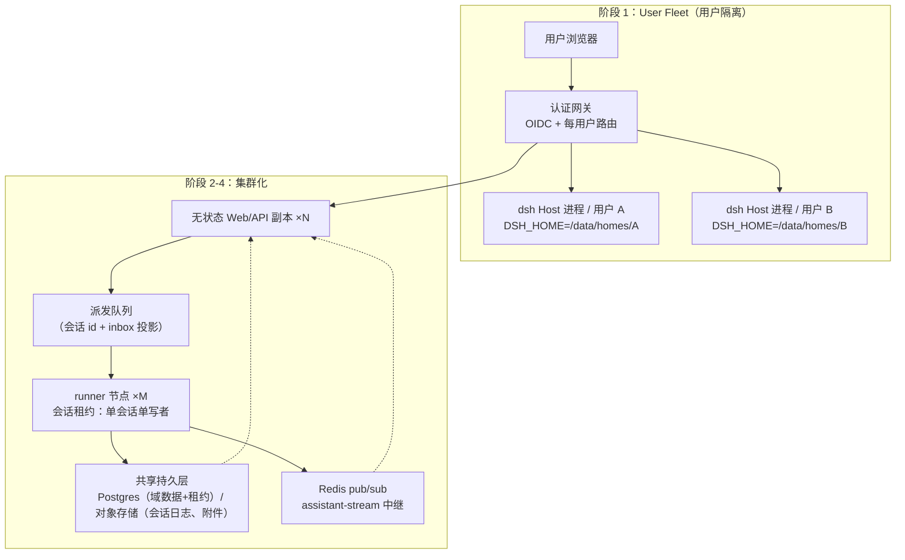

# 多用户数据隔离与集群部署 — 差距分析与落地方案

> 最后更新：2026-10-06。分析基线：`dsh` 0.2.1-alpha.1（commit `5badb15009`）。
> 文档性质：前瞻性分析笔记（note），不是已生效规格。方案落地须按 OpenLogos 流程拆为 `openlogos change` 提案序列（见 §11）。

## 0. 结论摘要

| 目标 | 可行路径 | 核心改造量 |
|---|---|---|
| 用户数据隔离 | **进程级隔离（User Fleet）**：认证网关 + 每用户独立 dsh Host 进程 + 每用户独立 `$DSH_HOME` | 小（核心零改动或近零改动；新增网关与 fleet 管理器两个新组件） |
| 集群部署 | **四步走**：共享存储后端 → 无状态接入层 → 执行池（租约 + 队列派发）→ Host 本地服务分布式化 | 中-大（全部落在既有 seam 的新增 Provider 上，核心缝不推翻） |

推进顺序：**先隔离、后集群**。用户隔离的第一阶段（进程级）不依赖集群；集群的共享存储是第二阶段的基础设施，两者在 M2 汇合（每用户命名空间落到共享存储的 key 前缀/行级租户上）。

## 1. 现状盘点 A：单用户假设清单（改造标的）

| # | 假设 | 证据 | 对目标的影响 |
|---|---|---|---|
| A1 | 一个 Harness home（`~/.dsh` 或显式 `$DSH_HOME`）承载全部用户数据：会话、凭证、设置、附件、溢出、工作区、插件 | `packages/util/home-paths/README.md:12,34-45` | 双刃：单 home 是隔离障碍，但**显式 home 路径已是产品能力**（Python SDK 就这么用）→ 进程级隔离的现成抓手 |
| A2 | Web 认证 = 启动令牌 → 会话 cookie，一个进程一个凭证，文档明示「只与预期用户共享」 | `docs/user/guide/public-deployments.md:31` | 无用户概念：任何持令牌者完全等价 → 需要真正的每用户认证 |
| A3 | 凭证单库：`$DSH_HOME/.credentials.yaml` + `.env` | `packages/credentials/credentials-local/` | 用户 A 的模型 key 会对用户 B 可用 → 隔离必须包含凭证 |
| A4 | 身份是安装级匿名 id，不是用户级 | `packages/identity/anonymous-user-id` | 遥测/反馈无法按用户归属或按用户隔离 |
| A5 | 审批与提问面向「同机一个人」：Web answerer 单注册 | `packages/interaction/user-approval`（fail-closed）、`docs/subsystems/approval.md` | 多用户下审批必须路由到**发起会话的用户** |
| A6 | 定时提醒 Host 级本地定时器，交付依赖本 Host 的 Session controller | `packages/schedule/schedule/README.md:12,26` | 集群下必须分布式调度或绑定到 runner |
| A7 | 终端/PTY、后台 jobs 进程本地 | `packages/terminal/`、`packages/jobs/`（process-local） | 集群下需要节点亲和路由或归属 runner |
| A8 | agent 注册表、`agent/assistant-stream` 进程本地；stream 的远端消费者只有 Web Session-follow 适配器 | `docs/architecture.md` §Turn flow/§Session log | 跨节点必须中继流事件 |
| A9 | webhook 入口在单 Host 进程内创建 Workspace Session | `packages/webhook/webhook/README.md` | 多副本下入口与执行解耦即可，改造小 |
| A10 | 插件/配置热重载（HMR）与插件管理器面向单机 profile 目录 | `packages/boot/hmr`、`plugin-manager` | 集群下配置分发要镜像化或共享只读层 |

## 2. 现状盘点 B：集群友好资产（已留好的缝）

| # | 资产 | 证据 | 用途 |
|---|---|---|---|
| B1 | `SessionPersistence` 缝（`create/open/stat/list/export` + 共享 handle 脚手架），架构文档明列「Store sessions in a new backend」扩展点 | `docs/architecture.md` §Where new behavior goes、`packages/session/session-persistence` | **不改核心**新增 Postgres/S3 后端；JSONL 后端的 `runPersistenceContract`/`runLiveWritePathContract` 缝测试套可直接约束新后端 |
| B2 | 会话格式代际制 + 相邻迁移链（v0→v4），已提交代际不可变 | `docs/architecture.md` §Session log | 滚动升级期间新旧节点共存的读取兼容基础 |
| B3 | durable inbox 投影：冷读可用（无活 Agent 也能读 pending input），`agent/inbox/*` 结构化事件 | `packages/core/agent-loop/README.md:71,118` | 「会话在任何节点恢复」的派发依据：队列只需投递会话 id，runner 靠 inbox 投影接续 |
| B4 | storage hub：命名后端注册表 + SQLite/JSON 后端 + domain KV（单调 `SCHEMA_VERSION`） | `packages/storage/*`、`storage-sqlite/src/schema.ts:20` | 新增共享 KV 后端（Postgres）即可承载 schedule/workspace/投影缓存等域数据 |
| B5 | 进程外执行先例：subagent 已有 acp/claude-code/codex/dsh-sdk 四种进程外后端；ssh 族把 fs/subprocess/sandbox 整体切到远程世界 | `packages/subagent/*`、`packages/ssh/*` | 「agent 在别处跑」在本仓已有两套先例，执行池是同一模式的规模化 |
| B6 | `--public-url` + `--trusted-host` 反向代理部署路径（TLS 终结、前缀剥离、cookie 改写） | `docs/user/guide/public-deployments.md` | 网关雏形：认证网关在其上叠加，而非另起炉灶 |
| B7 | OTel 双通道遥测 + session-telemetry 缝（捕获/投影/脱敏/上报） | `packages/telemetry/otel`、`packages/session/session-telemetry*` | 集群可观测性现成 |
| B8 | 单写者语义已有实现范式：JSONL 后端的 in-process single-writer claims；审批 fail-closed | `session-persistence-jsonl/README.md:100` | 跨节点会话租约的设计蓝本（把「进程内 claim」升级为「DB 租约」） |

## 3. 目标定义与验收口径

**G1 用户数据隔离**：
1. 每个用户经独立身份认证（OIDC/OAuth 或等价物），无全局共享凭证。
2. 跨用户默认零可见：会话列表、会话内容、附件、凭证、设置、工作区、提醒、反馈互相不可达（授权在服务端强制，不靠前端隐藏）。
3. 数据命名空间分离：上述每类数据的存储键含用户维度。
4. 审计可归属：审批、敏感操作、模型调用归属到用户。
5. 沙箱/工作区文件系统边界按用户划分。

**G2 集群部署**：
1. 接入层多副本：任一 Web/API 节点可服务任一会话的浏览与控制。
2. 执行池化：agent turn 在 runner 节点执行；同一会话同一时刻至多一个活跃 runner（单写者）；runner 崩溃后会话可在其他节点恢复。
3. 持久层集中：会话日志、域数据、附件在共享存储（Postgres/对象存储），节点无本地独占状态。
4. 滚动升级：借助会话格式代际与相邻迁移，升级不要求停机迁移全量数据。
5. Host 本地服务（schedule/webhook/终端/jobs）在多副本下语义正确（不重复投递、不丢事件、终端路由到属主节点）。

## 4. 方案总览

里程碑与依赖：

| 里程碑 | 内容 | 依赖 | 交付判据 |
|---|---|---|---|
| M0 | 单用户假设审计冻结（§1 清单复核入档） | 无 | 本文档 §1 经代码复核确认 |
| M1 | User Fleet：认证网关 + fleet 管理器 + 每用户 home | M0 | G1 的 1/2/3/5 达成（单机版） |
| M2 | 共享持久层：SessionPersistence/存储/附件的新后端 + 每用户命名空间 | M1 | 会话与域数据可存 Postgres/对象存储；G1-3 落到共享存储 |
| M3 | 执行池：会话租约 + 队列派发 + 流中继 + 终端亲和 | M2 | G2 的 1/2/3 达成 |
| M4 | Host 本地服务分布式化 + 滚动升级演练 | M3 | G2 的 4/5 达成 |

## 5. M1 用户隔离（User Fleet）— 事项清单

**新组件（2 个，均为新包，不动现有包语义）**：
1. `dsh-gateway`（或复用现有反代 + 新增认证层）：OIDC 登录 → 每用户会话；按用户路由到其专属 Host 进程的 loopback 端口；令牌只在内网传递（现有启动令牌机制原样保留在网关之内层）。
2. `dsh-fleet-manager`：为每个首次登录用户 `spawn` 一个 `dsh --profile web --port 0 --dump`（OS 分配端口），设置该进程 `DSH_HOME=/data/homes/<uid>`；空闲回收、崩溃重启、并发上限。python runtime 已示范「显式 home + 子进程启动」全套路数（`python/sdk-runtime`）。

**现有包改动（小）**：
- `web-app` startup：已支持 `--host/--port/--no-open`，补一个「信任来自 loopback 网关的转发头」配置项（若 `--trusted-host` 校验尚不覆盖 X-Forwarded-*，补齐）。
- 审计：`anonymous-user-id` 增加可选的「fleet 注入用户标识」读取（env 或 cmdline 传入），遥测与反馈带上用户维度（G1-4）。

**明确不做（M1 阶段）**：不改任何存储格式、不动 session 格式、不做进程内多租户。隔离边界 = 操作系统进程 + 文件系统目录，这是 dsh 沙箱哲学的自然延伸。

**验收**：两个用户同时使用同一部署，A 在会话列表/设置/凭证/附件/审批上完全看不到 B 的任何数据；A 的审批卡只出现在 A 的浏览器；任一用户进程崩溃不影响另一用户。

**工作量估计**：网关 + fleet 管理器 2-4 周（含 fleet 管理的测试）；现有包改动 ≤1 周。

## 6. M2 共享持久层 — 事项清单

1. **会话日志**：新增 `session-persistence-postgres`（元数据+锁）与/或对象存储 blob 后端，实现 `SessionPersistence` 缝并跑通既有缝测试套（B1）。会话内容（事件字节）放对象存储，Postgres 存索引与代际指针。
2. **域数据**：`storage-sqlite` 旁新增 `storage-postgres`（KV 面），`storage-domain` 不变——schedule/workspace/投影缓存/凭证引用等域自动获得共享承载。每用户命名空间 = 域 key 前缀 `<uid>:`（G1-3），由 storage-domain 提供方统一注入，域实现不感知。
3. **全文检索**：`session-query-sqlite` 的集中式替代（Postgres FTS）或按用户分库；`SCHEMA_VERSION` 机制沿用（现值 8，重置派生表的路径已内建）。
4. **附件/溢出**：`attachment-local`/`spill-local` 旁新增对象存储后端（缝已抽象）。
5. **凭证**：M1 阶段每用户 home 已物理分离；M2 可选升级为 KMS 加密的集中凭证库（`ctx.credentials` 新 provider），设置面继续只存引用。

**验收**：双节点指向同一共享层，各自能打开同一用户的历史会话；`test:snapshot` 与缝契约测试在新后端全绿；每用户命名空间互不可见。

**工作量估计**：6-10 周（大头在 SessionPersistence 后端的 LiveWritePath 契约与崩溃一致性）。

## 7. M3 执行池 — 事项清单

1. **会话租约**：Postgres 租约表（`session_id, owner_node, lease_expires_at`），续约由 runner 心跳完成；过期租约可被接管（对应 JSONL 后端 single-writer claim 的跨节点版，B8）。`agent-loop` 不感知租约——租约在「启动 Agent 前获取、丢租约即 cancel」的外层实现。
2. **派发**：复用 durable inbox（B3）：用户发消息 → 网关写入会话（经持有租约的节点或直接写共享层）→ 队列投递 `(session_id)` → 任意空闲 runner 尝试取租约并从 inbox 投影接续。webhook 会话创建走同一条路（A9）。
3. **流中继**：runner 把 `agent/assistant-stream` 帧 + `session/event` 发布到 Redis pub/sub 频道 `session:<id>`；所有 Web/API 副本订阅并转发给自己的浏览器连接（现 Session-follow 适配器是唯一远端消费者，A8，新增一个 Redis 适配器即可，不改事件语义）。
4. **终端/jobs 亲和**：PTY 与进程本地 jobs 绑定在持有租约的 runner 节点；Web 副本的终端 Remote 调用按会话租约路由（网关查租约表转发）。长期可演进为把终端后端也切到 ssh 式远程世界（B5）。

**验收**：kill 掉正在执行 turn 的 runner，≤ 租约过期时间内该会话在其他节点恢复并继续 inbox 中未消费输入；两个浏览器连不同 Web 副本看同一会话，流式输出均实时到达；同一会话在两个 runner 同时被触发执行的竞争被租约排除（测试注入）。

**工作量估计**：8-12 周（租约接管正确性与流中继是难点）。

## 8. M4 Host 本地服务分布式化 — 事项清单

1. **schedule**：到期计算移到 Postgres（`FOR UPDATE SKIP LOCKED` 取任务），交付动作投递到持有对应会话租约的 runner（或先取租约再交付）；「重启后恢复」「仅补最近一次错过的 recurring」语义保持（A6 的行为契约不变，只换触发器）。
2. **webhook**：入口副本无状态化——签名校验后只写队列；Workspace Session 创建由执行池消费。
3. **插件/配置分发**：profile 组合层镜像化（镜像内烘焙 `dsh-base` 等固定层），用户层（`cordis.patch.yml`、安装插件）放共享存储只读挂载；HMR 在集群模式禁用（headless/SDK profile 已有先例）。
4. **滚动升级**：runner 按会话粒度排空（租约不续、等 turn 边界结束）；新旧版本并行的读取兼容由会话代际+相邻迁移兜底（B2）；发布前跑 `test:snapshot` 全量。

**验收**：两副本 + 两 runner 的部署下：提醒不重复投递也不丢；webhook 事件恰创建一个会话；滚动升级期间进行中的会话不中断、升级后旧会话可打开。

**工作量估计**：4-6 周。

## 9. 被否决的替代路径（记录理由）

- **进程内多租户优先**：把 `uid` 维度加进 session 事件、每个 SQLite 表、投影、凭证、审批路由。否决理由：触及 A1-A10 几乎每一条，`SCHEMA_VERSION` 全面 bump、`SessionEventMap` 全面演进，且单进程故障域覆盖所有用户（隔离性反而弱于进程级）；先做它是最大风险路径。M2 之后若单用户进程密度成为成本问题，可在共享存储之上重新评估。
- **直接上 K8s Operator 编排 dsh**：M1 的 fleet 管理器可以先做成单机 supervisor；K8s 化（每用户一个 Pod/Deployment）作为 M1 的部署变体在 M3 后引入，避免一开始就把调试复杂度拉满。

## 10. 风险与约束

| 风险 | 缓解 |
|---|---|
| SessionPersistence 新后端崩溃一致性难（JSONL 后端的 revision/发表检查很精细） | 直接复用其缝契约测试套；先 Postgres 索引+对象存储字节的最小组合，不自创协议 |
| 租约接管造成 turn 半途重复执行 | 接管前必经「源事件日志重放 + inbox 投影」；接管点只允许 turn 边界（复用恢复语义的 interrupted closer） |
| 公开 API pre-stable：集群改造期间核心缝可能又变 | 全部新能力放新包/新 Provider，不改既有缝签名；破坏变更按仓库规则记 upgrade guide |
| 沙箱在后端节点不可用（无 landlock/seatbelt 的容器环境） | 沙箱后端本就按平台探测 fail-closed；集群镜像显式启用 bwrap/landlock，探测失败拒绝启动执行 |
| 模型 key 集中化后的泄露面 | 集中凭证仅 M2+ 引入，且经 KMS 加密；设置面继续只存引用（现状不变） |

## 11. OpenLogos 落地路径

1. M1 → `openlogos change user-fleet-gateway`（Why=本方案 §3-G1/§5；What=网关+fleet 交互规格；How=新包与 startup 改动的场景时序图）。
2. M2 → `openlogos change shared-persistence-backends`（每个后端一个场景：打开/写入/迁移/崩溃恢复）。
3. M3 → `openlogos change agent-runner-pool`（租约获取/接管/流中继时序图）。
4. M4 → `openlogos change distributed-host-services`。
5. 每个里程碑合入即按仓库规则更新 `docs/architecture.md` 对应节、写 upgrade guide（`--public-url` 部署语义、fleet 环境变量均为外部可感知面）、补 recorded-session 快照。
